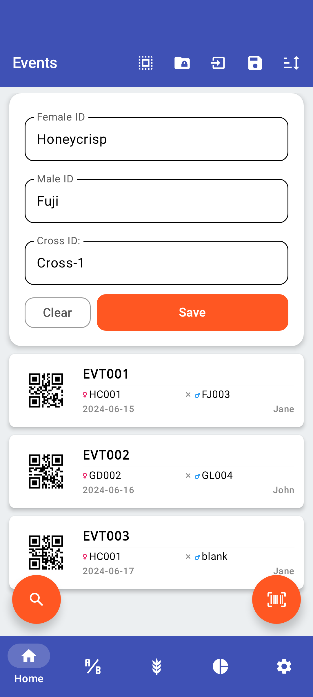
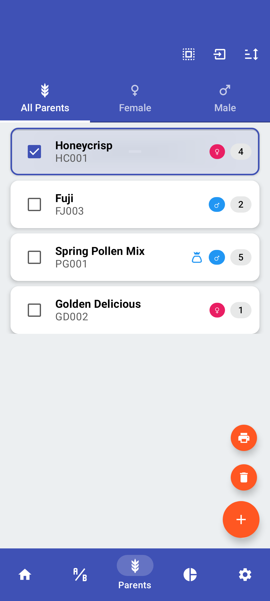

<link rel="stylesheet" type="text/css" href="_styles/styles.css">

# Intercross

## Introduction

Intercross is an open-source Android app designed for plant breeders to track and manage crossing activities. It supports recording parental crosses, tracking progress toward breeding goals with wishlists, collecting metadata, and printing custom labels via Zebra mobile printers.

Developed as part of the PhenoApps initiative, Intercross modernizes data collection in plant breeding using mobile technology.

<figure class="image">
    

        
    

    <figcaption class="screenshot-caption"><i>Intercross home screen - Create crosses and view recent activity</i></figcaption>
</figure>

## Getting Started

Download Intercross from:
- [Google Play Store](https://play.google.com/store/apps/details?id=org.phenoapps.intercross)
- [GitHub Releases](https://github.com/PhenoApps/Intercross/releases)

When you first open Intercross, complete:
1. Initial setup and permissions
2. Storage location selection
3. Profile configuration (optional but recommended)

## App Walkthrough

### 1. Home — Record Crosses
The primary screen for creating and viewing crossing events.

<figure class="image">
    

        
    

    <figcaption class="screenshot-caption"><i>Home screen with cross entry form and saved crosses</i></figcaption>
</figure>

### 2. Cross Tracker — Monitor Progress
Track crossing goals with wishlists and color-coded progress indicators.

<figure class="image">
    

        
    

    <figcaption class="screenshot-caption"><i>Cross Tracker with planned cross progress</i></figcaption>
</figure>

### 3. Parents — Manage Germplasm
View, create, and configure parent plants and pollen groups.

<figure class="image">
    

        
    

    <figcaption class="screenshot-caption"><i>Parents list filtered by type</i></figcaption>
</figure>

### 4. Summary — Visualize Data
Charts and statistics for crosses, metadata, and crossing patterns.

<figure class="image">
    

        
    

    <figcaption class="screenshot-caption"><i>Summary dashboard with key metrics</i></figcaption>
</figure>

## Key Features

| Feature | Description |
|---------|-------------|
| Cross Recording | Enter parents via keyboard or barcode scanner |
| Wishlist Tracking | Set targets and monitor progress toward crossing goals |
| Cross Block Matrix | Visual grid of all parent combinations |
| Metadata Collection | Record seeds, fruits, flowers, and custom fields |
| Label Printing | Print barcoded labels via Zebra Bluetooth printers |
| Data Export | Export crosses as CSV files |
| Summary Charts | Visual analytics of crossing activity |

## Documentation Sections

- [App Intro](intro.md) — Initial setup, permissions, and storage
- [Home](home.md) — Cross entry, detail view, and scanning
- [Crosses](crosses.md) — Cross Tracker, wishlists, and Cross Block matrix
- [Parents](parents.md) — Parent management, pollen groups, and creation
- [Summary](graphs.md) — Charts and statistics
- [Export](export.md) — Data export and file format
- [Settings](profile.md) — Profile, behavior, printing, and database options
