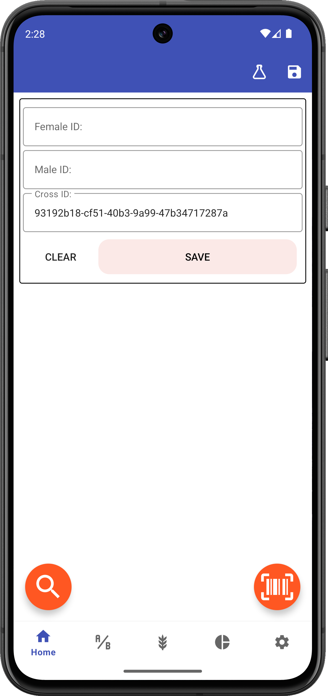

# Intercross

## Introduction

Intercross is an open-source Android app that tracks parental and cross IDs as crosses are made, who makes each cross, and where each cross is made. It allows printing cross labels to Zebra label printers and exporting lists of crosses to local files. Intercross is part of the broader PhenoApps initiative, an effort to modernize plant breeding and genetics data collection and organization.

<figure align="center" class="image">

<figcaption><i>Intercross home screen</i></figcaption>
</figure>

## Getting Started

Intercross can be downloaded from the [Google Play Store](https://play.google.com/store/apps/details?id=org.phenoapps.intercross) or installed manually from the latest [GitHub Release](https://github.com/PhenoApps/Intercross/releases).

When you first open Intercross, you'll need to:
1. Complete the initial setup
2. Grant necessary permissions
3. Set up storage location

## Structure

Intercross is organized into several key areas:

1. <a href="parents.md"></a> [Parents](parents.md) - Manage parent plants and their information
2. <a href="creating-crosses.md"></a> [Creating Crosses](creating-crosses.md) - Record new crossing events
3. <a href="wishlist.md"></a> [Wishlist](wishlist.md) - Plan and track crossing goals
4. <a href="settings.md"></a> [Settings](settings.md) - Configure app behavior
```