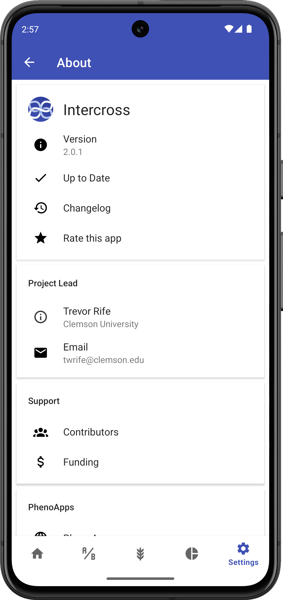

# About Intercross

## Overview

Intercross is an open-source Android application developed by the PhenoApps project to assist plant breeders in tracking crossing events in their breeding programs.

<figure align="center" class="image">

<figcaption><i>About screen</i></figcaption>
</figure>

## Version Information

The About screen displays:
- Current app version
- Build date
- Latest release notes

## PhenoApps

Intercross is part of the PhenoApps suite, a collection of open-source applications for field data collection in plant breeding and genetics.

Other apps in the PhenoApps suite include:
- Field Book - For collecting phenotypic data
- Coordinate - For managing field layouts
- Verify - For sample tracking

Visit [www.phenoapps.org](https://www.phenoapps.org) for more information.

## Development Team

Intercross is developed by a team at:
- Iowa State University
- University of Wisconsin-Madison
- Cornell University
- International Maize and Wheat Improvement Center (CIMMYT)

## Funding

The development of Intercross has been supported by:
- The National Science Foundation
- USDA-NIFA
- The Bill & Melinda Gates Foundation

## Open Source

Intercross is open source software released under the GPL-3.0 license. The source code is available on [GitHub](https://github.com/PhenoApps/Intercross).

## How to Contribute

You can contribute to Intercross development by:
- Reporting bugs or suggesting features on GitHub
- Contributing code through pull requests
- Helping translate the app to other languages
- Supporting documentation efforts

## Contact Information

For questions, suggestions, or support:
- Email: phenoapps@gmail.com
- GitHub: [github.com/PhenoApps/Intercross](https://github.com/PhenoApps/Intercross)
- Twitter: [@PhenoApps](https://twitter.com/PhenoApps)

## Acknowledgments

Special thanks to all the plant breeders and technicians who have provided feedback and suggestions to improve Intercross.