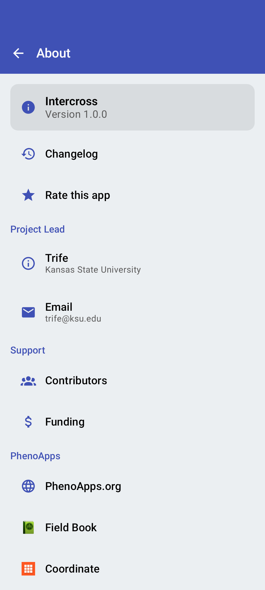

<link rel="stylesheet" type="text/css" href="_styles/styles.css">

# About Settings

<figure class="image">
    

        
    

    <figcaption class="screenshot-caption"><i>About settings screen</i></figcaption>
</figure>
