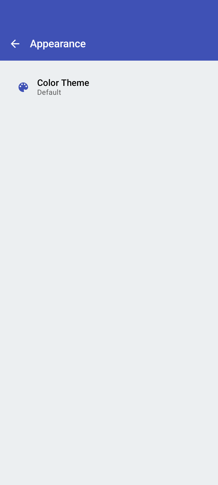
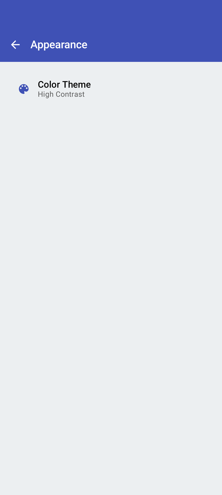

<link rel="stylesheet" type="text/css" href="_styles/styles.css">

# Appearance Settings

<figure class="image">
    

        
    

    <figcaption class="screenshot-caption"><i>Appearance settings screen</i></figcaption>
</figure>

Appearance settings allow you to customize the visual theme of Intercross.

## Theme Selection

Choose from the available theme options:

- **Default** - The standard Intercross theme
- **Green** - A specialized theme with green highlights
- **High Contrast** - Optimized for visibility in outdoor conditions

    <figure class="image">
        

            
        

        <figcaption class="screenshot-caption"><i>Green theme selection</i></figcaption>
    </figure>
    <figure class="image">
        

            
        

        <figcaption class="screenshot-caption"><i>High Contrast theme selection</i></figcaption>
    </figure>

The theme selection is persisted in your preferences and will be applied across all screens in the app.
