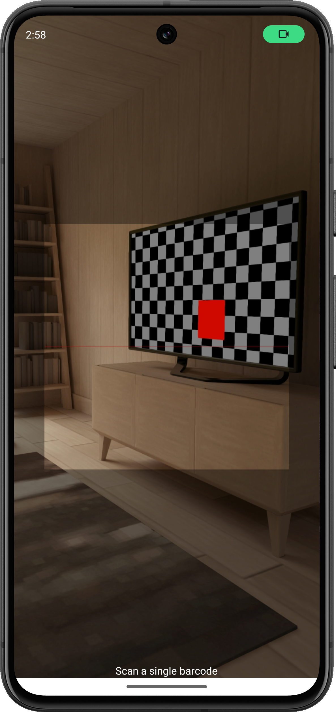

# Barcode Scanning

## Overview

Barcode scanning is a core feature of Intercross that allows rapid data entry when creating crosses or searching for existing records.

<figure align="center" class="image">

<figcaption><i>Barcode scanning screen</i></figcaption>
</figure>

## Accessing the Scanner

The barcode scanner can be accessed from multiple locations:
- The main crossing screen (camera icons next to ID fields)
- The dedicated barcode scan button in the toolbar
- The parent selection screens
- The continuous scanning mode

## Scanner Modes

### Single Scan Mode

In single scan mode, Intercross will scan a single barcode and return to the previous screen with the result. This is useful for:
- Scanning a single parent ID
- Locating a specific cross
- Verifying a barcode value

### Continuous Scanning Mode

Continuous mode allows scanning multiple barcodes in sequence without returning to the previous screen. This is ideal for:
- Rapid entry of crosses
- Scanning multiple parents
- Inventory operations

To access continuous mode, tap the infinity icon in the barcode scanning screen.

## Scan Workflow

When creating a cross with the barcode scanner:

1. Tap the female parent scan icon (or male, if "Scan Male First" is enabled)
2. Scan the barcode of the first parent
3. The app will automatically advance to the next field
4. Scan the barcode of the second parent
5. Review and save the cross

<figure align="center" class="image">

<figcaption><i>The scanning sequence for creating a cross</i></figcaption>
</figure>

## Audio Feedback

When Audio Notifications are enabled in [Workflow Settings](settings/workflow.md), the scanner will:
- Play a "plonk" sound for successful scans
- Play a different alert sound for errors or unrecognized barcodes

## Supported Formats

Intercross supports common barcode formats including:
- QR Codes
- Code 128
- Code 39
- Data Matrix
- UPC-A and UPC-E
- EAN-8 and EAN-13

## Tips for Successful Scanning

- Ensure adequate lighting when scanning
- Hold the device approximately 6-8 inches (15-20 cm) from the barcode
- Keep the device steady while scanning
- For best results, print barcodes with good contrast and appropriate size
- Clean the camera lens regularly to prevent blurry scans