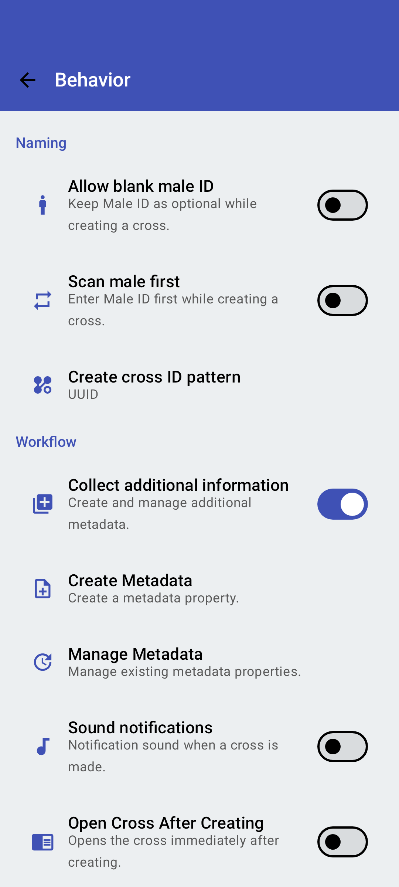

<link rel="stylesheet" type="text/css" href="_styles/styles.css">

# Behavior Settings

<figure class="image">
    

        
    

    <figcaption class="screenshot-caption"><i>Behavior settings screen</i></figcaption>
</figure>

## Naming

#### Allow Blank Male ID

When enabled, this setting allows you to record crosses without specifying a male parent.
This is useful for open pollinations and bulk pollen sources.

#### Scan Male First

By default, Intercross assumes you'll scan or enter the female parent ID first, followed by the male parent.
This setting reverses that order and displays the male parent input field first.

#### Create Cross ID Pattern

This feature allows you to switch from the default UUIDs to either a custom pattern for generating unique cross IDs or to no pattern.
Custom patterns can be used to make cross IDs shorter and more human-readable.
Selecting `No Pattern` allows users to input their own cross ID, often from a list of pre-printed labels.

See [Pattern Settings](pattern.md) for more details on configuring cross ID patterns.

## Workflow

#### Manage Metadata

Navigate to this option to edit or delete existing metadata properties.

#### Sound Notifications

Enables audio feedback for various actions within the app:
- Completed crosses

#### Open Cross After Creating

When enabled, this will automatically open the details page for a newly created cross immediately after it has been created.
This simplifies the process for entering metadata and allows you to review the cross information.

#### Reciprocal Crossing

When enabled this treats crosses consisting of `female A` x `male B` the same as `female B` x `male A` for the purposes of tracking progress towards crossing targets.
