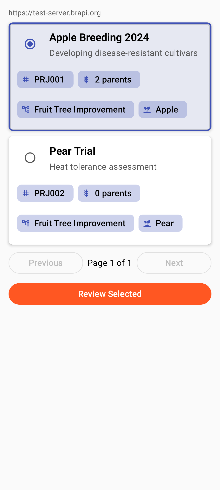
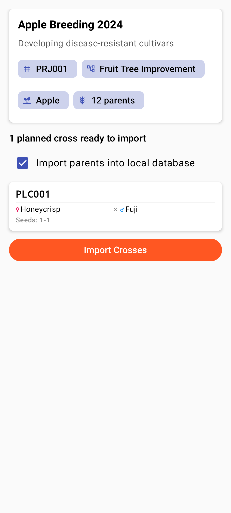

<link rel="stylesheet" type="text/css" href="_styles/styles.css">

# BrAPI Integration

## Overview

Intercross integrates with the **Breeding API (BrAPI)** to enable data exchange with breeding management systems like BreedBase. This allows you to:

- Import crossing plans and parent information
- Export completed crosses
- Sync wishlist data with external databases

<figure class="image">
    

        
    

    <figcaption class="screenshot-caption"><i>Browsing BrAPI crossing projects</i></figcaption>
</figure>

## BrAPI Settings

Configure BrAPI in **Settings > BrAPI**:

| Setting | Description |
|---------|-------------|
| **Server URL** | Your BrAPI server endpoint |
| **API Version** | v2.0 or later |
| **Authentication** | OAuth or API key |
| **Timeout** | Connection timeout in seconds |
| **Chunk Size** | Batch size for exports |

## Importing Crosses

To import planned crosses from BrAPI:

1. Tap the **Import icon** () in the **Events** or **Parents** screen
2. Select **"Import from BrAPI"**
3. Select your project from the list
4. Review planned crosses
5. Confirm import

<figure class="image">
    

        
    

    <figcaption class="screenshot-caption"><i>Reviewing planned crosses from BrAPI</i></figcaption>
</figure>

## Exporting Crosses

Export completed crosses to your BrAPI server:

1. Tap the **Export icon** () in the **Events** screen
2. Select **"BrAPI Export"**
3. Select target project
4. Review export summary
5. Confirm and send

<figure class="image">
    

        
    

    <figcaption class="screenshot-caption"><i>BrAPI export summary review</i></figcaption>
</figure>

## Troubleshooting

Common BrAPI issues:
- **Connection errors** — Check server URL and network connectivity
- **Authentication failed** — Verify API credentials
