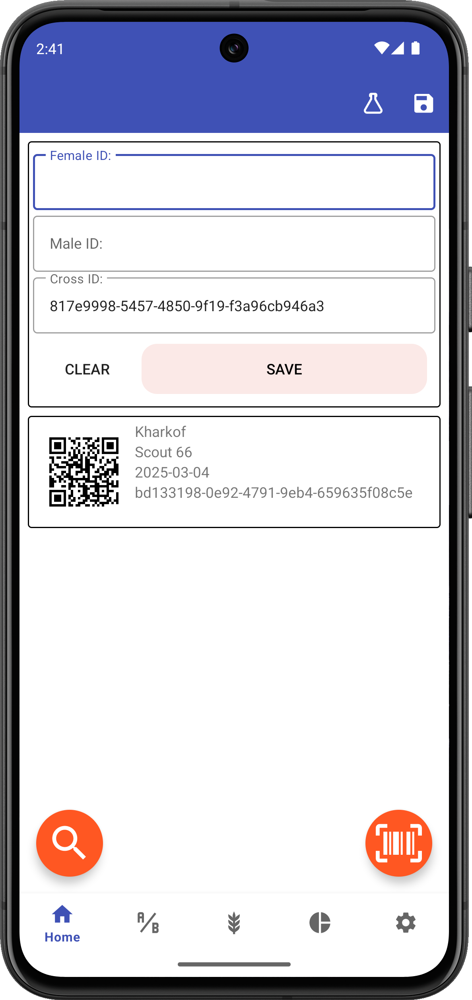

# Creating Crosses

## Overview

Creating crosses is the primary function of Intercross. The app allows you to record cross events by entering parent IDs and associated metadata.

<figure align="center" class="image">

<figcaption><i>Cross entry screen</i></figcaption>
</figure>

## Basic Cross Entry

To create a cross:

1. Enter a **female ID** (or scan a barcode)
2. Enter a **male ID** (or scan a barcode)
3. Enter a **cross ID** or use auto-generation
4. Press **Save**

<figure align="center" class="image">

<figcaption><i>Saved cross</i></figcaption>
</figure>

Cross IDs can be:
- Manually entered
- Automatically generated (see [Settings - Auto Cross](settings/auto-cross.md))

## Input Methods

Parent IDs can be entered in several ways:
- Manual keyboard entry
- Barcode scanning (using the camera icon in the lower left corner)
- Selecting from a list of previously entered parents

## Continuous Scanning

The infinity icon enables continuous barcode scanning mode, allowing you to rapidly scan multiple barcodes in sequence.

## Cross Record

Saved crosses will display:
- Barcoded cross ID
- Female ID
- Male ID
- Date of the cross
- Creator of the cross