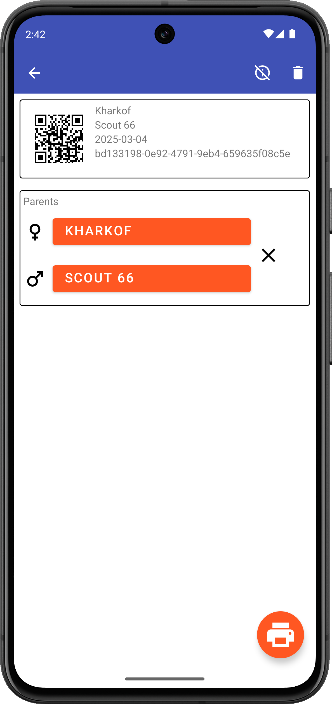
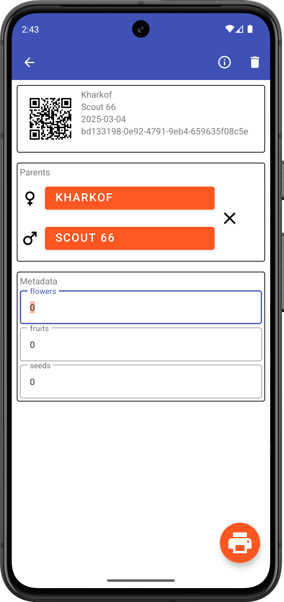

# Cross Details

## Overview

The Cross Details screen provides comprehensive information about a specific crossing event and allows you to manage its data.

<figure align="center" class="image">

<figcaption><i>Cross details screen</i></figcaption>
</figure>

## Accessing Cross Details

Access the details of a cross by:
- Tapping on a cross in the Events list
- Selecting a cross from the Cross Tracker
- Scanning a cross barcode

## Information Displayed

The Cross Details screen displays:
- Cross ID (with barcode)
- Female parent ID and name (if available)
- Male parent ID and name (if available)
- Date and time of the cross
- Creator of the cross
- Any additional metadata collected

## Actions Available

From the Cross Details screen, you can:

### Print a Label
Press the print icon to print a label for the cross using a Zebra printer. This requires proper printer setup in [Settings](settings/printing.md).

### Delete the Cross
Remove the cross record from the database. This action cannot be undone.

### Edit Metadata
If additional metadata collection is enabled in [Behavior Settings](settings/behavior.md), you can view and edit this information.

## Metadata Collection

When enabled, you can collect additional information about crosses:
- Success rating
- Notes
- Environmental conditions
- Custom metadata fields

<figure align="center" class="image">

<figcaption><i>Metadata collection form</i></figcaption>
</figure>

## Navigation

From the Cross Details screen, you can:
- Navigate to parent details by tapping parent IDs
- Return to the Events list using the back button
- Use the navigation drawer to switch to other app sections