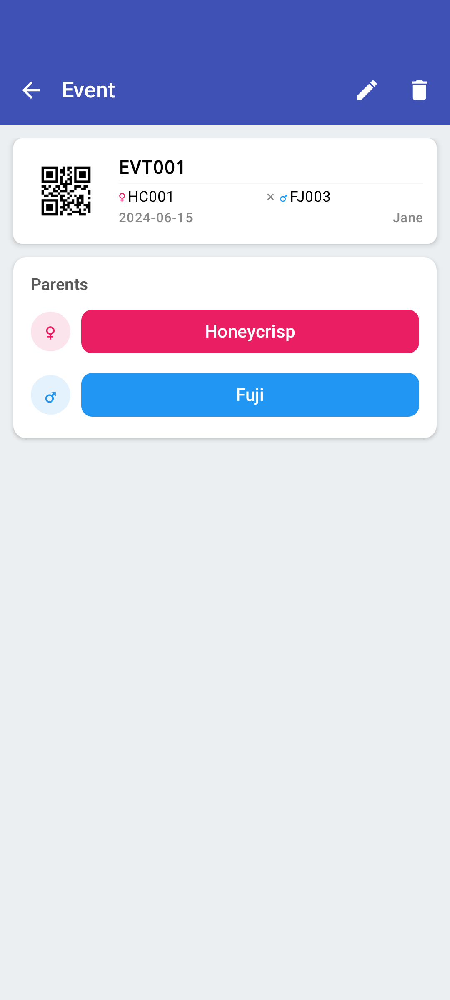
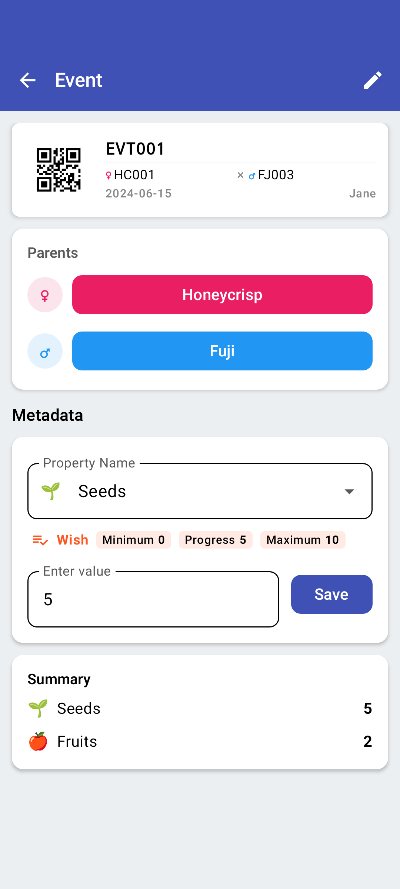

<link rel="stylesheet" type="text/css" href="_styles/styles.css">

# Cross Detail

The **Cross Detail** screen provides a comprehensive view of an individual crossing event. It allows you to review parent information, collect additional data (metadata), and track progress against your crossing targets.

<figure class="image">
    

        
    

    <figcaption class="screenshot-caption"><i>Cross detail screen showing parent info and metadata</i></figcaption>
</figure>

## Parent Information

The top of the screen displays detailed cards for both the female and male parents. This includes:
- **Parent Name and Code** — Clear identification of the germplasm.
- **Color-coded Buttons** — Tap to view more information about each parent.

## Metadata Collection

Intercross allows you to record extra information for each cross, such as the number of seeds, fruits, or flowers. 

### Metadata Entry

When metadata collection is enabled, a **Metadata** section appears. You can:
- Enter numerical values for any defined property.
- Use the **Edit** icon () in the top bar to toggle between viewing and editing metadata.

<figure class="image">
    

        
    

    <figcaption class="screenshot-caption"><i>Metadata entry with integrated wishlist progress</i></figcaption>
</figure>

### Wishlist Integration

If you have a [Wishlist](crosses.md#wishlist) defined for the current parent combination, your progress will be shown directly alongside the metadata entry fields. This helps you see exactly how many more items are needed to meet your target while you are recording the data.

- **Badges** — Small indicators show the current progress vs the target.

## Settings & Toggles

### Auto-Open Detail Page

To streamline your workflow, you can configure Intercross to automatically open the detail page immediately after a cross is saved:
1. Navigate to **Settings > Behavior**.
2. Toggle **"Open Cross After Creating"** to ON.

This is particularly useful when you need to record metadata (like "Flowers pollinated") at the exact moment the cross is made.

## Actions

- **Print Label** — Tap the print icon in the toolbar (if a Zebra printer is configured) to generate a physical label for this cross.
- **Delete Cross** — Tap the delete icon () to permanently remove the record. A confirmation dialog will appear.
- **Navigate to Related Crosses** — If other crosses exist for the same parent combination, they are listed at the bottom for quick navigation.
