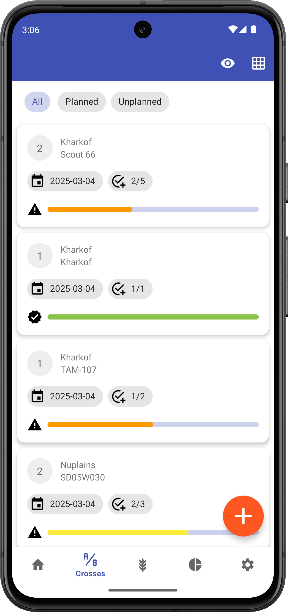

<link rel="stylesheet" type="text/css" href="_styles/styles.css">

# Crosses

## Overview

The Crosses screen helps you plan and manage crossing goals by tracking a wishlist of planned crosses and their completion status.

<figure class="image">
    
    <figcaption class="screenshot-caption"><i>Crosses screen showing wishlist progress</i></figcaption>
</figure>

## Top Toolbar Actions

Toolbar icons can be used to:
- Toggle the  to show/hide cross combinations that are completed
- Open the  [Wishgrid](wishgrid.md) view

## Cross Wishlist Details

The individual cross cards within the wishlist display:
- The two parents to be crossed
- Most recent date the two were crossed
- Current number of crosses completed vs minimum number of crosses desired
- Progress towards goal (colored-coded progress bar)

## Importing a Wishlist

Wishlists are typically imported from CSV files:

1. Press the  icon in the lower left of the screen
2. Choose "Import Wishlist"
3. Select from the list of files in `wishlist_import` folder

## Wishlist File Format

A wishlist file should include these columns:
- femaleDbId
- maleDbId
- femaleName
- maleName
- wishType
- wishMin
- wishMax

See the example `wishlist_sample.csv` file in the `wishlist_import` folder for more guidance.

## Tracking Progress

The wishlist automatically updates as crosses are completed to show progress towards listed goals.
Completed combinations (where the current count meets or exceeds the minimum) display a completely filled green progress bar and a checkmark.
Light green indicates the minimum has been met or exceeded, dark green indicates the max has been met or exceeded.