<link rel="stylesheet" type="text/css" href="_styles/styles.css">

# Crosses

## Overview

The Crosses screen helps you track crossing progress, visualize your breeding program, and manage wishlists. It provides two powerful views: the **Cross Tracker** list and the **Cross Block** matrix.

<figure class="image">
    

        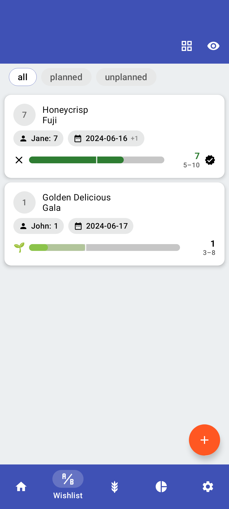
    

    <figcaption class="screenshot-caption"><i>Cross Tracker showing planned cross progress with progress bars</i></figcaption>
</figure>

## Cross Tracker

The Cross Tracker displays all parent combinations you've crossed, organized into planned (wishlist) and unplanned crosses.

### Filter Options

At the top of the screen, you can filter by:
- **All** — Show all crosses
- **Planned** — Show only wishlist crosses with targets
- **Unplanned** — Show crosses not on the wishlist

### Cross Tracker Cards

Each card shows:
- **Cross Count** — Total number of crosses made (large circle with number)
- **Parent Names** — Female and male parent names
- **Collector** — Who made the crosses (e.g., "Jane: 7")
- **Recent Date** — Date of most recent cross (click to view all dates in a calendar)
- **Wishlist Progress** — Progress bar showing completion toward targets
  - Green progress bar with checkmark = Target met or exceeded (≥ Max)
  - Light green = Minimum met (≥ Min)
  - Yellow/Orange = Partial progress (> 66%, > 33%)
  - Red = Started but below minimum

## Cross Dates Calendar

The **Cross Dates Calendar** allows you to visualize the timeline of your breeding activities for a specific parent pair.

<figure class="image">
    

        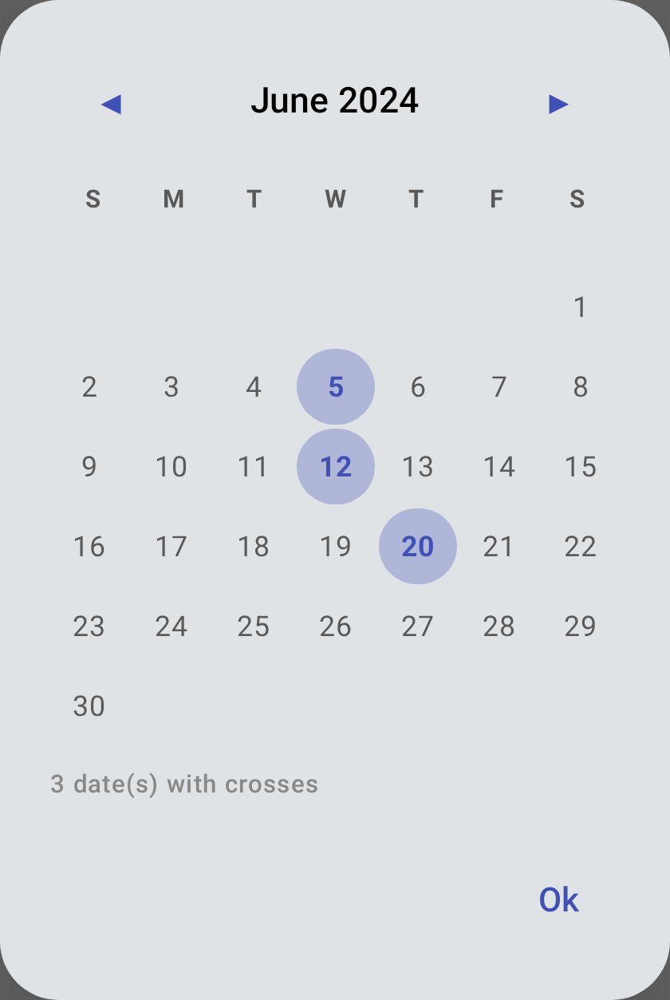
    

    <figcaption class="screenshot-caption"><i>Calendar visualization of crossing dates</i></figcaption>
</figure>

Dates with recorded crosses are highlighted, providing a clear view of your crossing window and effort over time.

## Wishlist

Create a wishlist to set crossing targets for specific parent combinations. Tap the **+** button in the bottom right to open the Wishlist Factory. The wizard guides you through three steps.

### Step 1 — Select Parents

Choose a female parent, then a male parent from the available lists. The **Next** button remains disabled until a parent is selected.

<figure class="image">
    

        

            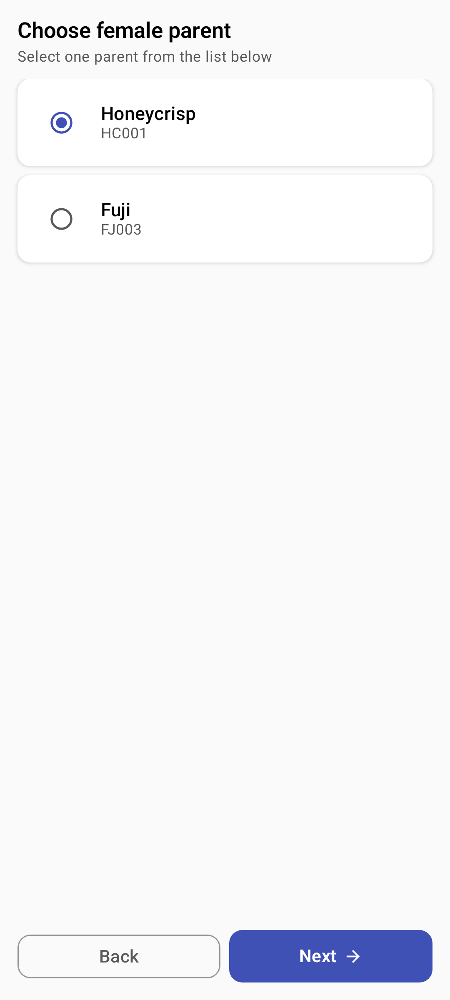
        

        

            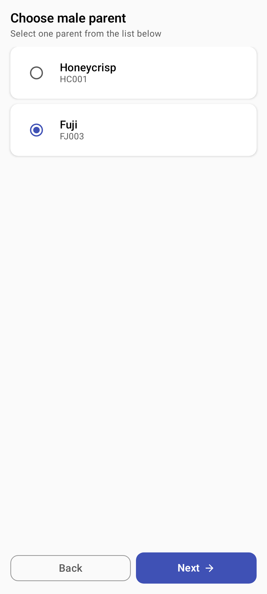
        

    

    <figcaption class="screenshot-caption"><i>Step 1: Select the female parent (left) then the male parent (right)</i></figcaption>
</figure>

### Step 2 — Define Targets

Set minimum and maximum targets for each wish type (Cross, Seed, Fruit, etc.). Each row shows validation errors inline — for example, min must be > 0 and max must be ≥ min.

<figure class="image">
    

        

            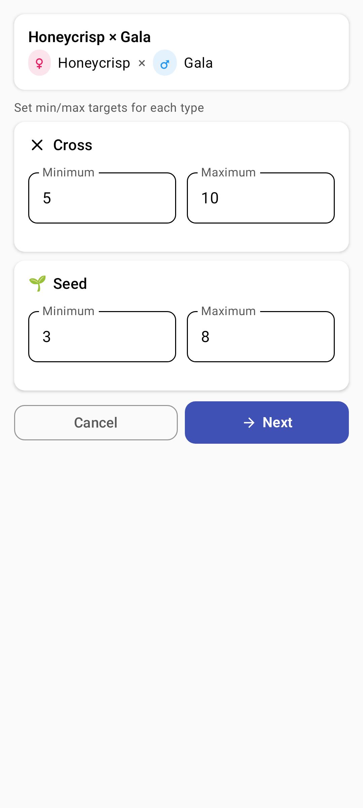
        

        

            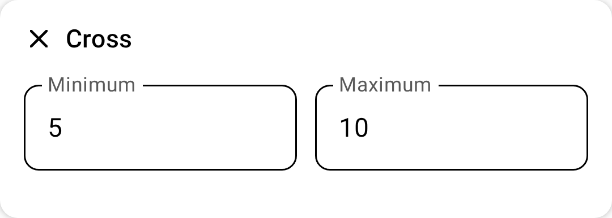
        

    

    <figcaption class="screenshot-caption"><i>Step 2: Full values screen (left) and a valid draft row with min/max targets (right)</i></figcaption>
</figure>

<figure class="image">
    

        

            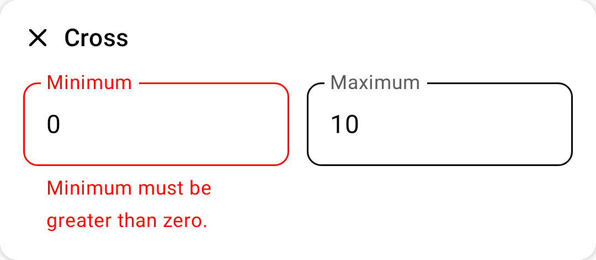
        

        

            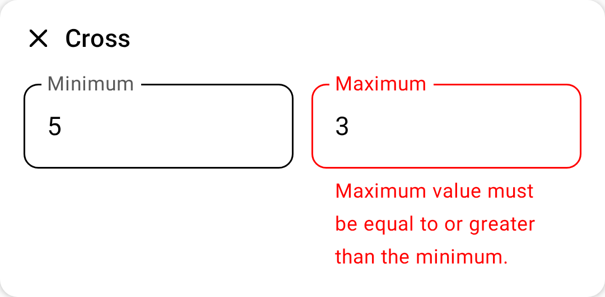
        

    

    <figcaption class="screenshot-caption"><i>Validation: min must be > 0 (left); max must be ≥ min (right)</i></figcaption>
</figure>

### Step 3 — Review & Confirm

Review all wishlist items for the selected parent pair before saving. You can go back to edit targets or confirm to create the entries.

<figure class="image">
    

        

            
        

        

            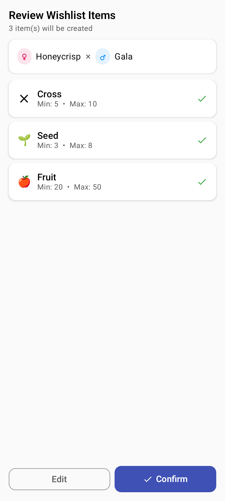
        

    

    <figcaption class="screenshot-caption"><i>Step 3: Review with two wish types (left) or three wish types including Fruit (right)</i></figcaption>
</figure>

### Wishlist Import

You can also import wishlists to quickly populate your targets. Tap the **Import** icon () in the top bar of the Crosses screen.

If BrAPI is configured, you can choose between:
- **Local File** — Import from a CSV file on your device.
- **BrAPI Server** — Import planned crosses (wishlist) from a breeding database.

#### Wishlist CSV Format

You can also import wishlists from CSV files with these columns:
- `femaleDbId`
- `maleDbId`
- `femaleName`
- `maleName`
- `wishType`
- `wishMin`
- `wishMax`

## Cross Block

The Cross Block view displays your wishlist as a color-coded matrix, making it easy to see which crosses are complete and which still need work.

<figure class="image">
    

        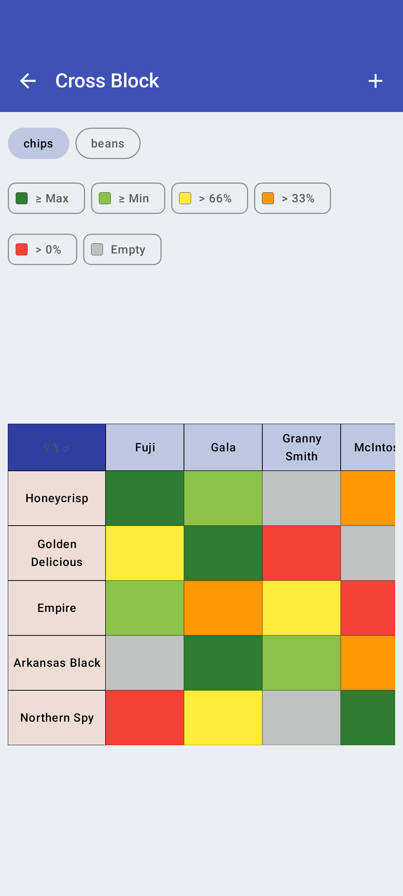 
    

    <figcaption class="screenshot-caption"><i>Cross Block matrix with progress indicators</i></figcaption>
</figure>

### Cross Block Legend

Colors indicate progress toward your crossing targets:
- **Green (✓)** — Target met (≥ Max)
- **Yellow** — Above 66% progress
- **Orange** — Above 33% progress
- **Red** — Started but below 33%
- **White** — No crosses made yet
- **Empty** — No wishlist entry for this pair

### Interacting with Cross Block

- **Tap a cell** — View existing crosses for that pair and create a new cross
- **Filter by progress** — Use checkboxes at top to highlight cells by progress level

## Wishlist Details

Tapping a row in the Cross Tracker or a cell in the Cross Block matrix opens the **Wishlist Detail** screen. This page provides a comprehensive overview of a specific male-female parent pairing.

<figure class="image">
    

        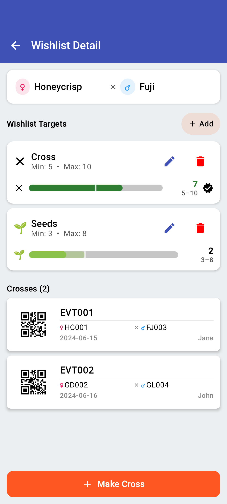
    

    <figcaption class="screenshot-caption"><i>Wishlist Detail showing progress and historical crosses</i></figcaption>
</figure>

### Detail Page Features

- **Progress Overview**: See exactly how many crosses, seeds, or fruits have been recorded against your targets.
- **Cross History**: A list of all historical crossing events for this specific pair.
- **Quick Actions**:
    - **Make Cross**: Navigates back to the entry screen with parents pre-filled.
    - **Add Target**: Define a new crossing target (e.g., if you only had "Seeds" but now want to track "Fruits").

### Editing Targets

You can update your minimum and maximum targets at any time by tapping the edit icon next to a progress row.

<figure class="image">
    

        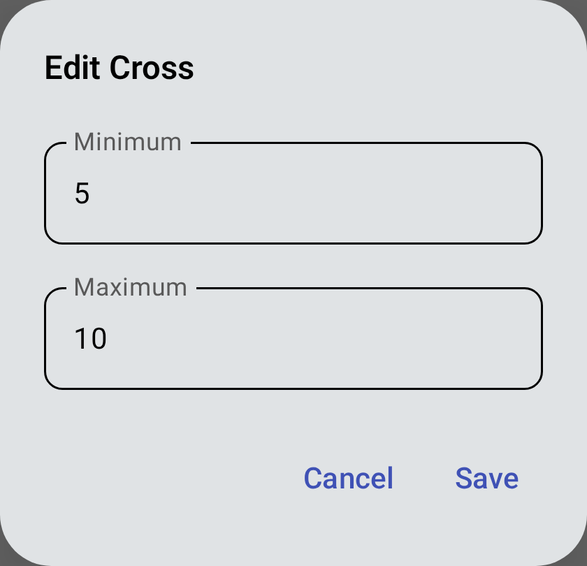
    

    <figcaption class="screenshot-caption"><i>Editing wishlist targets</i></figcaption>
</figure>

