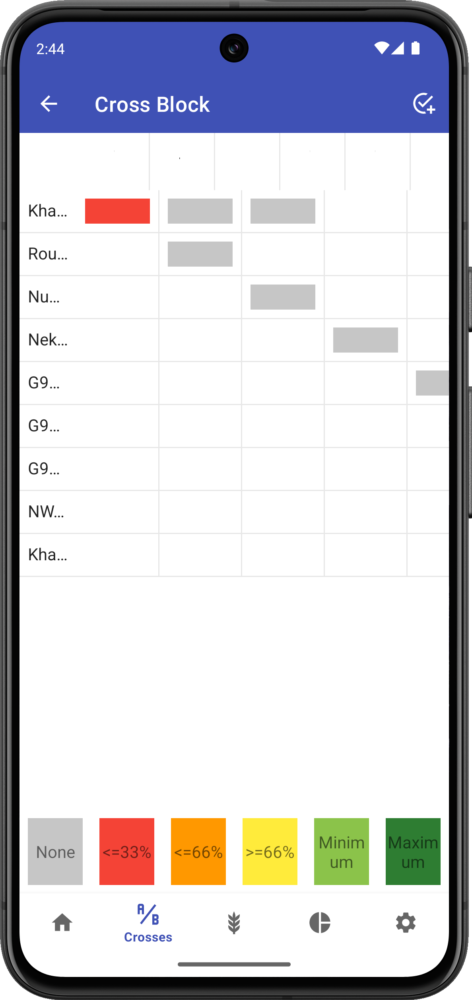

<link rel="stylesheet" type="text/css" href="_styles/styles.css">

# Crosses

## Overview

The Crosses screen helps summarize the crosses that have already been made and helps to manage specific crossing goals by tracking a wishlist of planned crosses and their completion status.

<figure class="image">
    
    <figcaption class="screenshot-caption"><i>Crosses screen showing wishlist progress</i></figcaption>
</figure>

## Top Toolbar Actions

Toolbar icons can be used to:
- Show/hide cross combinations that are completed ()
- Open the  Wishgrid view

## Cross Details

The contents of each cross card depend on if the cross was planned or unplanned.
For all crosses that have been made, the card displays the total number of crosses, the parent combinations, and the date of the most recent cross.

For crosses that are part of the wishlist (see below), the cross card also displays the number of crosses completed/desired and a color-coded progress bar.
Completed combinations (where the current count meets or exceeds the minimum) display a completely filled green progress bar and a checkmark.
Light green indicates the minimum has been met or exceeded, dark green indicates the max has been met or exceeded.

## Wishlist

While Intercross can be used to make *ad hoc* crosses, it can also be used to ensure specific crosses are made using a wishlist.
To add a wishlist, press the  icon in the lower left of the screen.
Wishlist items can be created within the app using existing parents or imported from an external list (saved in the `wishlist_import` folder).

<figure class="image">
    
    <figcaption class="screenshot-caption"><i>File import screen</i></figcaption>
</figure>

### Wishlist File Format

A wishlist file should include these columns:
- femaleDbId
- maleDbId
- femaleName
- maleName
- wishType
- wishMin
- wishMax

The `wishlist_sample.csv` file in the `wishlist_import` folder can be used as a template for wishlist creation.

## Wishgrid

The Wishgrid displays the wishlist in a matrix format, making it easier to see crossing progress and opportunities.

<figure class="image">
    
    <figcaption class="screenshot-caption"><i>Wishgrid visualization</i></figcaption>
</figure>

The Wishgrid displays female and male parents along the two axes and the intersecting cells indicating desired crosses.
White cells indicate no crossing is planned between two parents and additional colors demonstrate progress toward reaching the set maximum number of crosses for any parent combination.

Selecting a cell will show a list of the existing crosses that have been made and allow the user to create a new cross from the pair of parents.