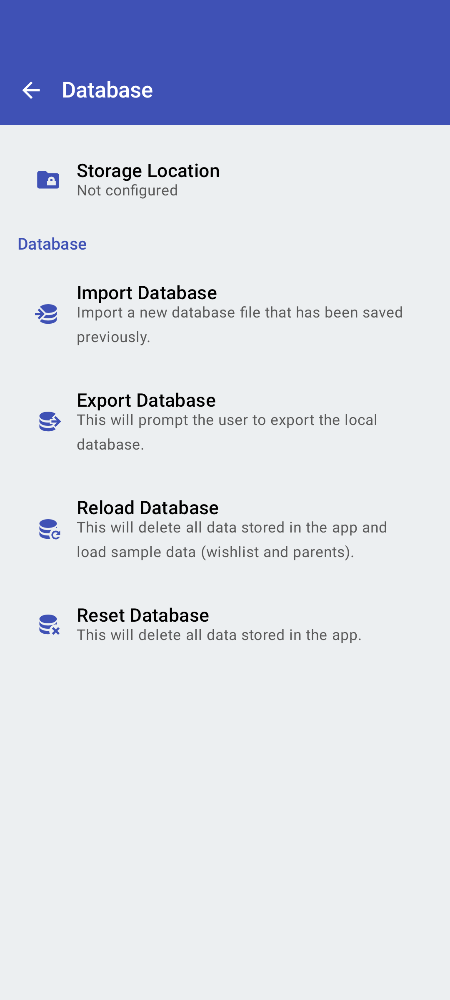
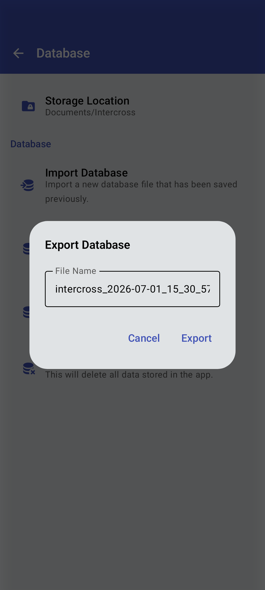

<link rel="stylesheet" type="text/css" href="_styles/styles.css">

# Database Settings

## Overview

Database settings in Intercross allow you to update the default storage location or reset, import, and export the app database.

<figure class="image">
    

        
    

    <figcaption class="screenshot-caption"><i>Database settings screen</i></figcaption>
</figure>

####   Define storage location

Opens the <a href="#/storage">Storage</a> dialog to define or update the **Storage location** on the device.

####  Reset database

Wipes all data from the app. Shows a confirmation dialog first before doing so.

####  Import database

Opens the file picker to pick a database to import (should be a previously exported database file).
This replaces the current data in the app.

####  Export database

<figure class="image">
    

        
    

    <figcaption class="screenshot-caption"><i>Database export dialog</i></figcaption>
</figure>

Allows you to specify a filename and save the entire internal database as a backup. This is useful for migrating data between devices or for technical support.
