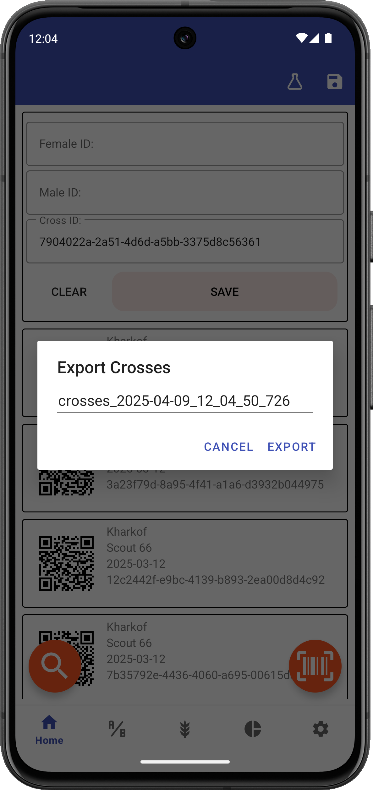

<link rel="stylesheet" type="text/css" href="_styles/styles.css">

# Exporting Data

## Overview

Intercross allows you to export your crossing data to various formats for analysis, record-keeping, or sharing.

<figure align="center" class="image">

<figcaption><i>Export dialog</i></figcaption>
</figure>

## Export Process

To export your data:

1. Navigate to the Events screen
2. Tap the export icon in the toolbar
3. Enter a filename for your export
4. Select export options
5. Press "Export"

## Export Format

Crossing data is exported with columns including:
- `femaleObsUnitID` - ID of the female parent
- `maleObsUnitID` - ID of the male parent
- `crossID` - Unique identifier for the cross
- `timestamp` - Date and time of the cross
- `person` - Name of the person who made the cross
- `experiment` - Name of the experiment
- Additional metadata fields (if collected)

## Export Location

Exported files are saved to:
```
/Intercross/crosses_export/
```

You can access these files using any file manager app on your device or by connecting your device to a computer.

## Filtering Exports

To export only specific crosses:

1. Use the filter option in the Events screen to narrow down the list
2. Select "Export Filtered Results" from the export dialog

## Data Security

Exported data files don't contain any personal information beyond what you've entered as the operator name. Always maintain appropriate data security practices when sharing export files.

## Importing Into Other Software

Exported CSV files can be opened in:
- Spreadsheet software (Excel, Google Sheets, etc.)
- Statistical analysis programs
- Database systems
- Custom breeding management software