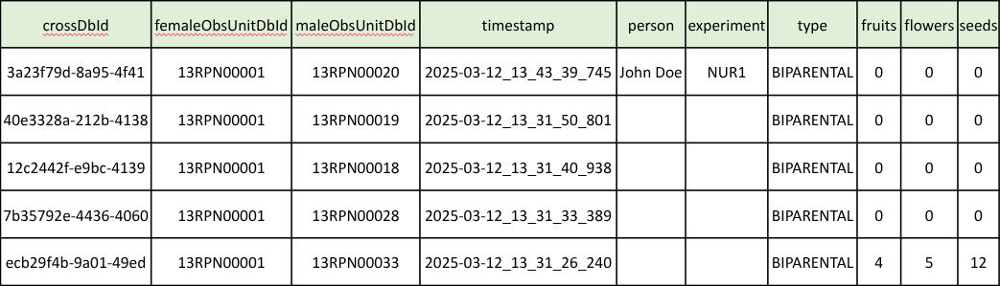

<link rel="stylesheet" type="text/css" href="_styles/styles.css">

# Exporting Data

## Overview

Intercross allows you to export your crossing data for analysis, record-keeping, or sharing.

<figure class="image">
    
    <figcaption class="screenshot-caption"><i>Export dialog</i></figcaption>
</figure>

## Export Process

To export your data:

1. Navigate to the Home screen
2. Tap the  icon in the toolbar
3. Enter a filename for your export
4. Press "Export"
5. Choose whether to delete the newly-exported crosses from the app

## Export Format

Crossing data is exported as a csv file with the following columns populated with data:
- `crossID` - Unique identifier for the cross
- `femaleObsUnitID` - ID of the female parent
- `maleObsUnitID` - ID of the male parent
- `timestamp` - Date and time of the cross
- `person` - Name of the person who made the cross (if set)
- `experiment` - Name of the experiment (if set)
- `type` - Type of cross (e.g., BIPARENTAL)
- Additional metadata fields like `fruits`, `flowers`, `seeds` (if collected)

<figure class="image">
    
    <figcaption class="screenshot-caption"><i>Example export file</i></figcaption>
</figure>

## Export Location

Exported files are saved to:

```
/Intercross/crosses_export/
```

These files can be accessed using a file manager app on your device or by connecting your device to a computer.