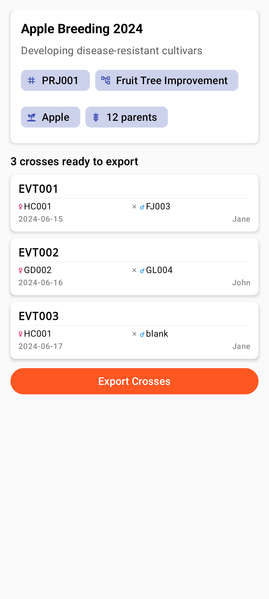
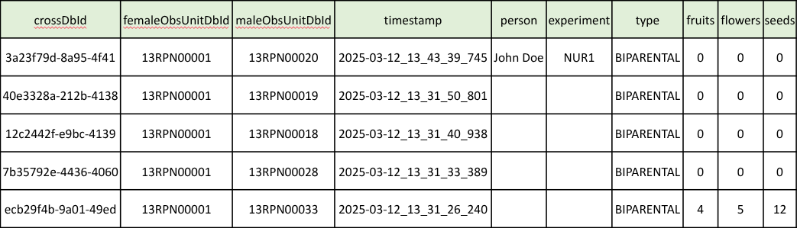

<link rel="stylesheet" type="text/css" href="_styles/styles.css">

# Exporting Data

## Overview

Intercross allows you to export your crossing data for analysis, record-keeping, or sharing with other researchers. You can export data locally as CSV files or send it directly to a breeding database via BrAPI.

## Local Export

To export your data locally:

1. Navigate to the **Events screen** (Home)
2. Tap the **Export icon** () in the top bar
3. If BrAPI is configured, a dialog will ask you to choose between **"Local Export"** and **"BrAPI Export"**. Select **"Local Export"**.
4. Choose a save location and filename in the system file picker
5. The data will be saved as a CSV file

## BrAPI Export

If you have configured a BrAPI server, you can export your crosses directly to a specific crossing project.

<figure class="image">
    <div class="screenshot-frame">
        
    </div>
    <figcaption class="screenshot-caption"><i>Reviewing crosses before BrAPI export</i></figcaption>
</figure>

1. Tap the **Export icon** () in the top bar
2. If BrAPI is enabled, select **"BrAPI Export"** from the choice dialog.
3. Select the target crossing project
4. Review the summary of crosses ready for export
5. Tap **"Export Crosses"** to upload the data

## Export Format (CSV)

Crossing data is exported as a CSV file with the following columns:

| Column | Description |
|--------|-------------|
| `crossID` | Unique identifier for the cross |
| `femaleObsUnitID` | ID of the female parent |
| `maleObsUnitID` | ID of the male parent |
| `timestamp` | Date and time of the cross |
| `person` | Name of the person who made the cross |
| `experiment` | Name of the experiment |
| `type` | Type of cross (e.g., BIPARENTAL, OPEN, SELF) |
| `flowers`, `fruits`, `seeds` | Metadata fields (if collected) |

<figure class="image">
    
    <figcaption class="screenshot-caption"><i>Example CSV export file format</i></figcaption>
</figure>

## Export Location

Exported files are saved to:

```
/Intercross/crosses_export/
```

These files can be accessed:
- Using a file manager app on your Android device
- By connecting your device to a computer via USB

## Database Export

For complete data backup, you can also export the entire app database. This is useful for migrating your entire workflow to another device.

For more details on managing your database, see the [Database Settings](database.md) documentation.
