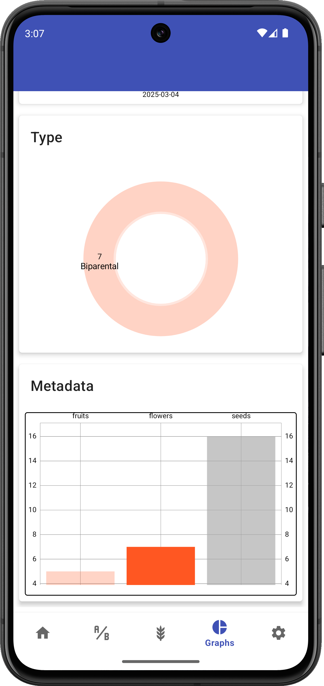

<link rel="stylesheet" type="text/css" href="_styles/styles.css">

# Graphs

## Overview

The Graphs screen provides visual representations of your crossing data, helping you analyze progress and patterns in your breeding program.

<figure align="center" class="image">

<figcaption><i>Graphs screen</i></figcaption>
</figure>

## Features

The Graphs screen organizes information into different tabs, each providing a different perspective on your crossing data:

### Crosses over time

This tab displays a chart of cross counts by date:

This visualization helps you understand the progress of crossing activity over time in your program.

<figure align="center" class="image">

<figcaption><i>Crosses over time</i></figcaption>
</figure>

### Cross Types

This tab shows a pie chart of the distribution of different cross types in your program:
- Biparental crosses
- Open pollinations
- Self-pollinations
- Other cross types

This helps you quickly visualize the proportion of different crossing strategies being used.

<figure align="center" class="image">

<figcaption><i>Cross types pie chart</i></figcaption>
</figure>

### Metadata Summary

This tab presents a bar chart of accumulated metadata fields such as:
- Fruits per cross
- Seeds per cross
- Flowers per cross
- Other custom metadata fields

<figure align="center" class="image">

<figcaption><i>Metadata summary bar chart</i></figcaption>
</figure>

## Interacting with Graphs

You can tap different sections of the pie charts to highlight specific data points. The corresponding data details will be displayed in the list below the chart.

## Data Display Rules

- Categories with zero counts are not displayed in the visualizations
- If no data exists for a particular tab, the chart area will appear empty
- Percentages are calculated based on the total count of relevant entries