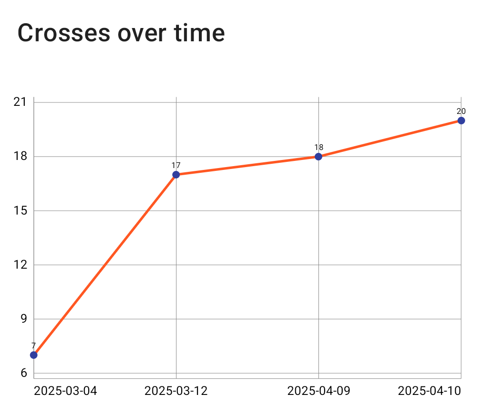
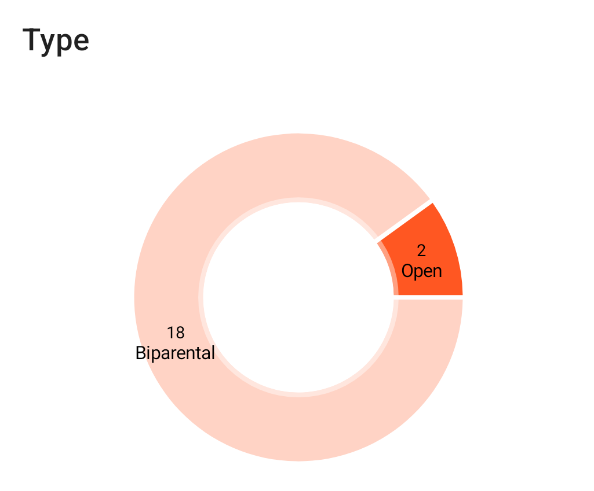
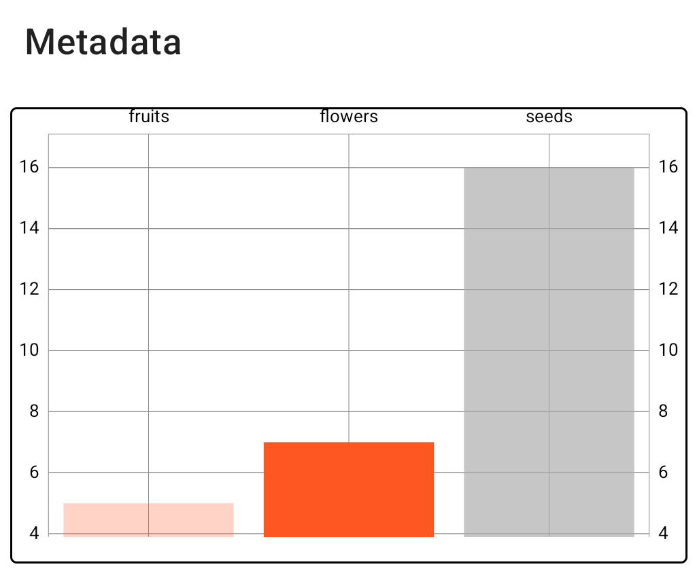

<link rel="stylesheet" type="text/css" href="_styles/styles.css">

# Graphs

The Graphs screen provides visual representations of your crossing data in several different graphs.

<figure class="image">
    
    <figcaption class="screenshot-caption"><i>Graphs screen</i></figcaption>
</figure>

## Crosses over time

This graph displays a chart of accumulating cross counts by date and helps you understand the crossing activity over time in your program.

<figure class="image">
    
    <figcaption class="screenshot-caption"><i>Crosses over time</i></figcaption>
</figure>

## Cross Types

This pie chart shows a distribution of different cross types in your program including biparental crosses, open pollinations, self-pollinations, and other cross types.
This helps you quickly visualize the proportion of different crossing strategies being used.

<figure class="image">
    
    <figcaption class="screenshot-caption"><i>Cross types pie chart</i></figcaption>
</figure>

## Metadata Summary

This bar chart displays accumulated metadata fields including the number of flowers, fruits, and seeds as well as other custom metadata fields.

<figure class="image">
    
    <figcaption class="screenshot-caption"><i>Metadata summary bar chart</i></figcaption>
</figure>

## Data Display Rules

- Categories with zero counts are not displayed in the visualizations
- If no data exists for a specific graph, the chart area will appear empty
- Percentages are calculated based on the total count of relevant entries