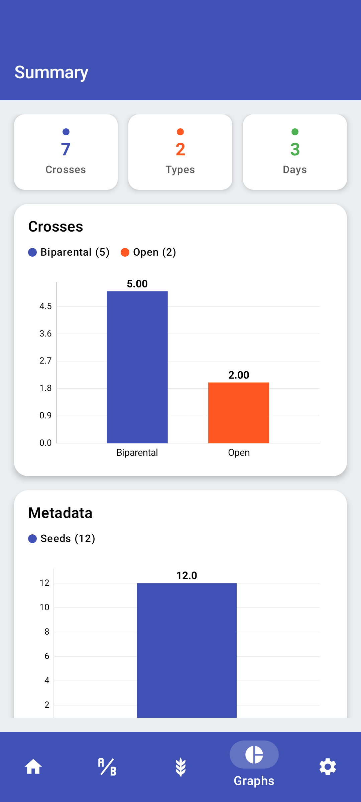

<link rel="stylesheet" type="text/css" href="_styles/styles.css">

# Summary

The Summary screen provides visual representations of your crossing data through interactive charts and statistics.

## Overview

<figure class="image">
    

        
    

    <figcaption class="screenshot-caption"><i>Summary screen with key metrics and charts</i></figcaption>
</figure>

The Summary dashboard displays:
- **Key Metrics** — Quick stats at the top (total crosses, types, active days)
- **Crosses Chart** — Bar chart showing cross type distribution
- **Metadata Chart** — Bar chart showing collected metadata (seeds, fruits, flowers)
- **Crosses Over Time** — Line chart showing crossing activity trends

## Key Metrics Cards

Three summary cards display at the top:
- **Crosses** — Total number of recorded crosses
- **Types** — Number of different cross types
- **Days** — Number of days with crossing activity