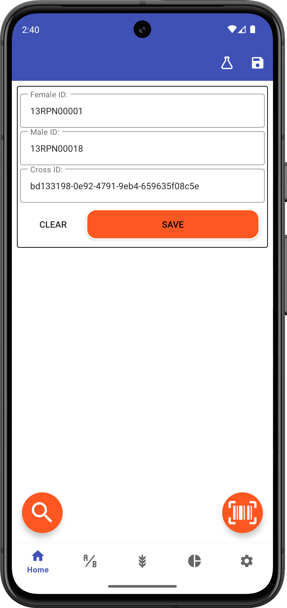
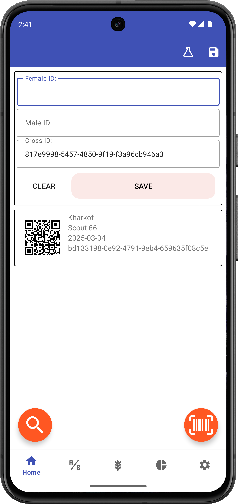

<link rel="stylesheet" type="text/css" href="_styles/styles.css">

# Home

## Overview

Creating crosses is the primary function of Intercross. The app allows you to record cross events on the home screen by entering parent IDs, and access created crosses to manage them and collect metadata.

<figure align="center" class="image">

<figcaption><i>Cross entry screen</i></figcaption>
</figure>

## Top Toolbar Actions

Toolbar icons can be used to:
-  Set experiment name
-  Export crosses to a csv file

## Basic Cross Entry

To create a cross:

1. Enter a **female ID** (or scan a barcode)
2. Enter a **male ID** (or scan a barcode)
3. Enter a **cross ID** or use auto-generation
4. Press **Save**

<figure align="center" class="image">

<figcaption><i>Saved cross</i></figcaption>
</figure>

## Input Methods

Parent IDs can be entered in several ways:
- Manual keyboard entry
- Barcode scanning (using the  icon in the lower right corner)
- Selecting from the list of desired parent combos on the crosses screen
  
## Cross Record

Saved crosses will display:
- Barcoded cross ID
- Female ID
- Male ID
- Date of the cross
- Cross ID
- Person (if set in Profile settings)

## Cross Detail Screen

Press on an individual cross record to access its detail screen. Alternatively press the   icon in the lower right to jump to a specific cross by scanning its barcode.

<figure align="center" class="image">

<figcaption><i>Cross detail screen</i></figcaption>
</figure>

The cross detail screen includes options to:
-  Enable metadata collection and collect metadata such as
  - number of flowers
  - number of fruits
  - number of seeds
-  Delete the cross
-  Print a barcoded cross label