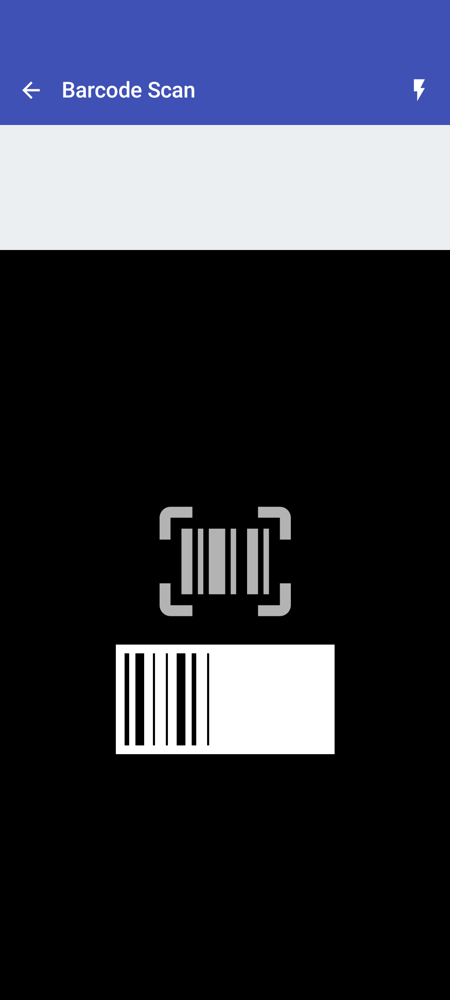
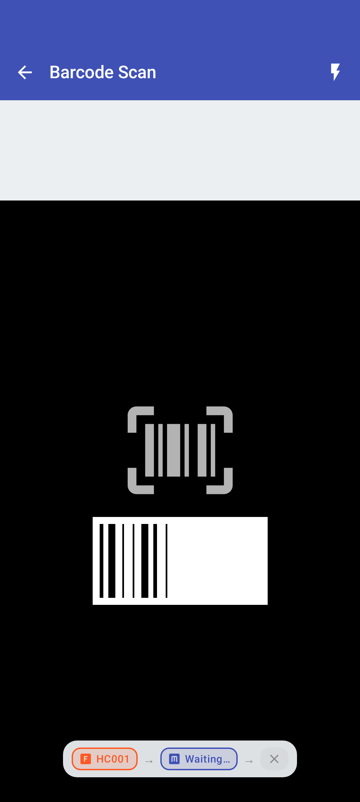
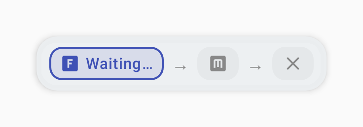
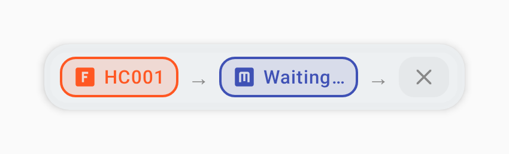
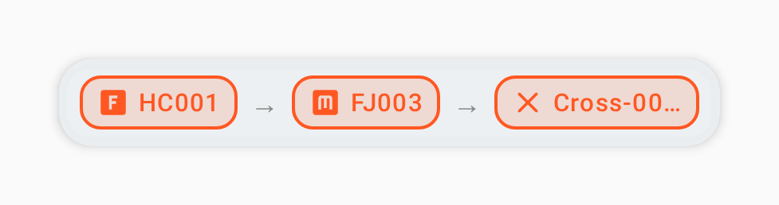
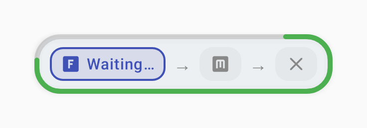
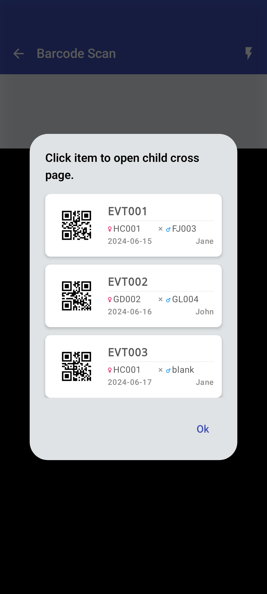
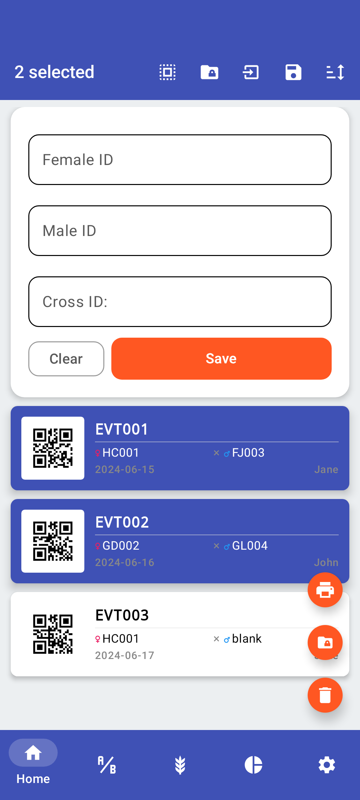
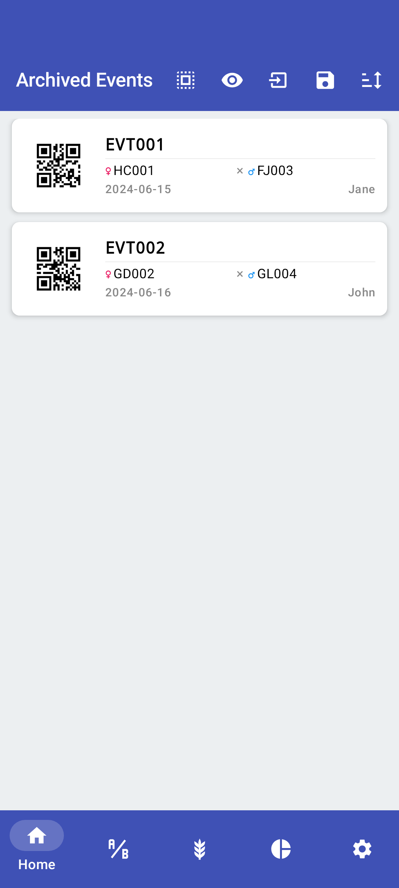
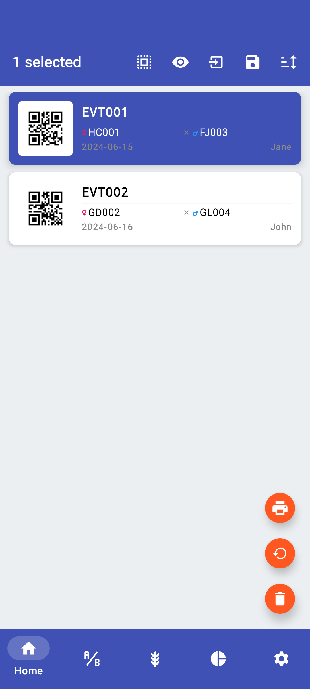

<link rel="stylesheet" type="text/css" href="_styles/styles.css">

# Home

## Overview

The Home screen is the primary interface for creating and managing crossing events in Intercross. Here you can record new crosses, view existing crosses, and access cross details for metadata collection and label printing.

<figure class="image">
    

        
    

    <figcaption class="screenshot-caption"><i>Home screen with cross entry form and recent crosses</i></figcaption>
</figure>

## Cross Entry Form

The top of the Home screen contains the cross entry form with three fields:

- **Female ID** — Enter or scan the barcode of the female parent
- **Male ID** — Enter or scan the barcode of the male parent
- **Cross ID** — Auto-generated or manually entered cross identifier

### Creating a Cross

1. Enter or scan the **Female ID** (tap the barcode scanner icon in the lower right corner)
2. Enter or scan the **Male ID**
3. The **Cross ID** will auto-populate based on your settings (or enter one manually)
4. Press **Save** to record the cross

## Barcode Scanning Modes

Intercross features a versatile barcode scanner (tap the FAB in the bottom right) with multiple modes to optimize your workflow.

### Single Scan

In **Single Scan** mode, scanning a barcode immediately returns the result to the active input field. This is the default mode when tapping the scanner icon next to an ID field.

<figure class="image">
    

        
    

    <figcaption class="screenshot-caption"><i>Single scan mode</i></figcaption>
</figure>

### Continuous Scan

**Continuous Scan** mode allows you to scan a sequence of barcodes (Female → Male → Cross ID) without leaving the scanner interface. The app provides visual feedback for each slot in the sequence and automatically saves the cross once all required fields are filled. Long-press the barcode scanner to open this feature.

<figure class="image">
    

        
    

    <figcaption class="screenshot-caption"><i>Continuous scan mode with sequence tracking</i></figcaption>
</figure>

#### Sequence Scan Indicator

At the bottom of the continuous scanner, a sequence indicator shows your current progress:
- **Chips** — Each field (Female, Male, Cross ID) is represented by a chip.
- **Scanned State** — When a barcode is scanned, the chip turns orange and displays a truncated version of the scanned code.
- **Waiting State** — The active slot is highlighted and shows "Waiting…".
- **Required Fields** — The indicator respects your workflow settings (e.g., if "Allow blank male ID" is enabled, the male slot may be skipped or optional depending on scan order).

#### Continuous Workflow & Cooldown

The scanner follows a structured flow to ensure data integrity while maintaining speed. The sequence indicator at the bottom guides you through each step:

<figure class="image">
    

        

            
        

        

            
        

        

            
        

    

    <figcaption class="screenshot-caption"><i>Scanning workflow: Waiting for Female (left), Waiting for Male (center), and Waiting for Cross ID (right)</i></figcaption>
</figure>

**Auto-Save & Feedback**: Once the final required barcode is detected, the app automatically submits the cross event. A green "Cross saved ✓" badge appears briefly at the bottom.

**Scanner Cooldown**: To prevent accidental double-scanning of the same labels immediately after saving, a **3-second cooldown** is enforced. During this time, a circular progress ring appears around the indicator, and the scanner is temporarily paused.

<figure class="image">
    

        
    

    <figcaption class="screenshot-caption"><i>Indicator showing the active 3-second cooldown after a successful save</i></figcaption>
</figure>

### Barcode Search

Use **Barcode Search** to quickly find parents or existing crosses.

<figure class="image">
    

        
    

    <figcaption class="screenshot-caption"><i>Searching for crosses via barcode</i></figcaption>
</figure>

## Managing Crosses

The saved crosses list supports multi-selection for bulk actions like deleting and archiving.

### Selecting & Bulk Actions

Long-press any cross card to enter selection mode. You can then tap additional cards to select multiple items.

<figure class="image">
    

        
    

    <figcaption class="screenshot-caption"><i>Bulk selection mode for crosses</i></figcaption>
</figure>

Once selected, you can use the top bar actions:
- **Delete** () — Permanently remove the selected crosses
- **Archive** () — Move crosses to the archive to keep your main list clean

### Import & Export

The top bar also provides actions for data exchange:
- **Import** () — Import crosses from a local CSV file or a BrAPI server.
- **Export** () — Export crosses locally or to BrAPI.

When BrAPI is enabled, tapping these icons will present a dialog asking you to choose your preferred source or destination.

### Archiving

Archiving helps you manage large datasets by hiding completed or older crosses from the primary view while keeping them available for export or future reference.

<figure class="image">
    

        

            
        

        

            
        

    

    <figcaption class="screenshot-caption"><i>Viewing the archive (left) and selecting items to unarchive (right)</i></figcaption>
</figure>

To view archived events, tap the **Archive** icon () in the top bar when no items are selected. 

To return archived items to your main list, select them within the archive view and tap the **Unarchive** icon () in the floating action button list. Tap the **View Active** icon () in the top bar to return to the main events list.

## Cross Detail Screen

For more information on how to view cross information, record metadata, and track progress, see the [Cross Detail](cross_detail.md) page.
