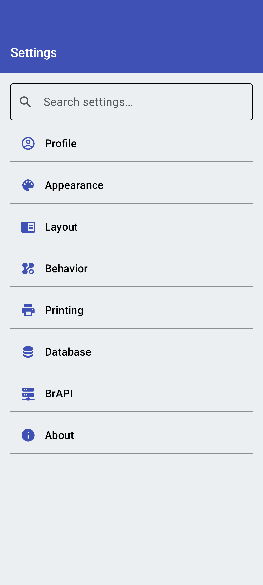
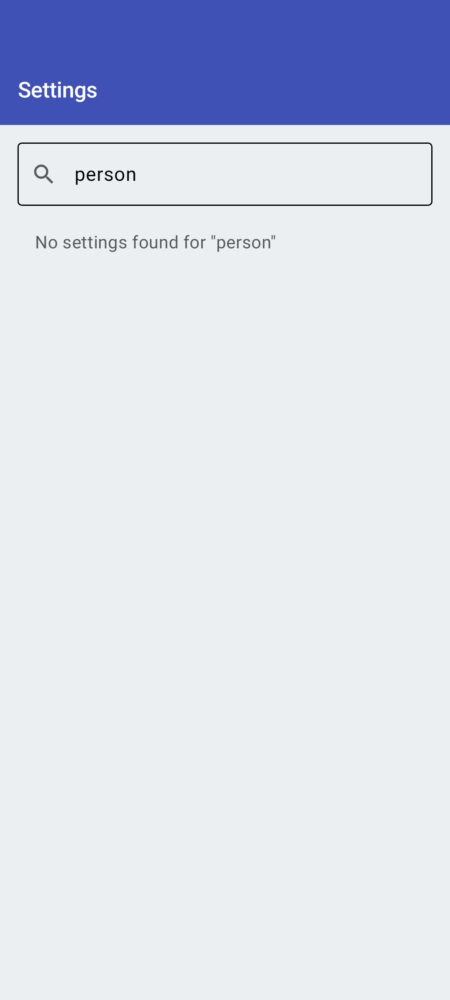

<link rel="stylesheet" type="text/css" href="_styles/styles.css">

# Settings Hub

The Settings Hub is the central entry point for all Intercross configuration options.

## Category List

<figure class="image">
    

        
    

    <figcaption class="screenshot-caption"><i>Settings hub showing all categories</i></figcaption>
</figure>

Settings are organized into the following categories:

- **Profile** - Person name and verification settings
- **Appearance** - Theme selection
- **Layout** - Display preferences
- **Behavior** - Cross creation workflow and naming options
- **Printing** - Zebra printer configuration
- **Database** - Import, export, and storage management
- **BrAPI** - Breeding API integration
- **About** - Version info and licenses

## Search

<figure class="image">
    

        
    

    <figcaption class="screenshot-caption"><i>Settings search for quick access to specific options</i></figcaption>
</figure>

Use the search bar at the top of the settings hub to quickly find specific settings across all categories.
