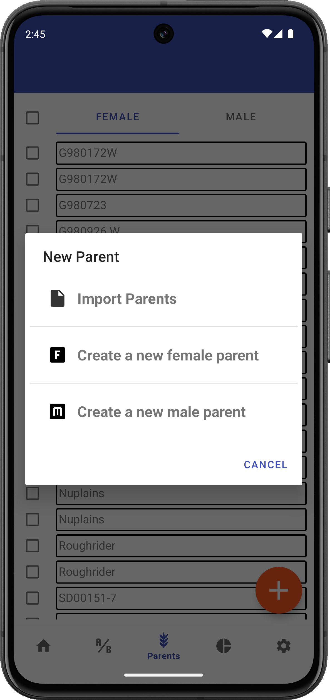
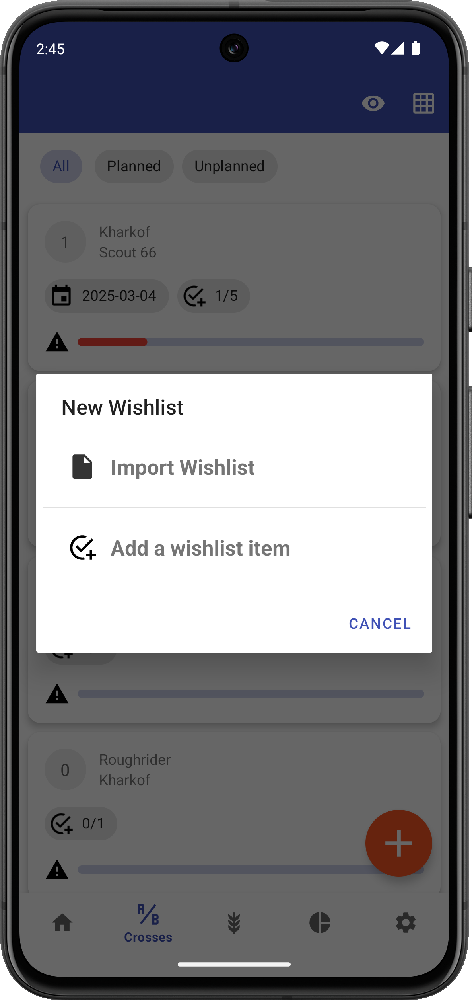

<link rel="stylesheet" type="text/css" href="_styles/styles.css">

# Importing Files

## Overview

Intercross allows importing wishlist and parent files to enhance functionality.

## Parents Import

<figure align="center" class="image">

<figcaption><i>File import screen</i></figcaption>
</figure>

The Parents import file format is a CSV containing a list of parents, typically with:
- Unique ID
- Name
- Sex (coded as `0 = female`, `1 = male`)

Example:
```
id,name,sex
15RPN00001,Kharkof,0
15RPN00002,Blueboy,1
```

## Wishlist Import

<figure align="center" class="image">

<figcaption><i>File import screen</i></figcaption>
</figure>

Wishlist imports must be in csv format, and are read from the `wishlist_import` folder.

Wishlist import files should contain the following columns:
- femaleDbId
- maleDbId
- femaleName
- maleName
- wishType
- wishMin
- wishMax

See the example `wishlist_sample.csv` file in the `wishlist_import` folder for more guidance.