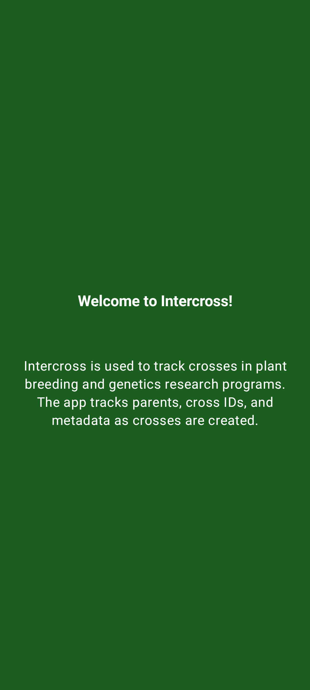
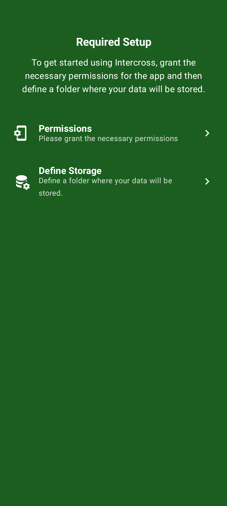
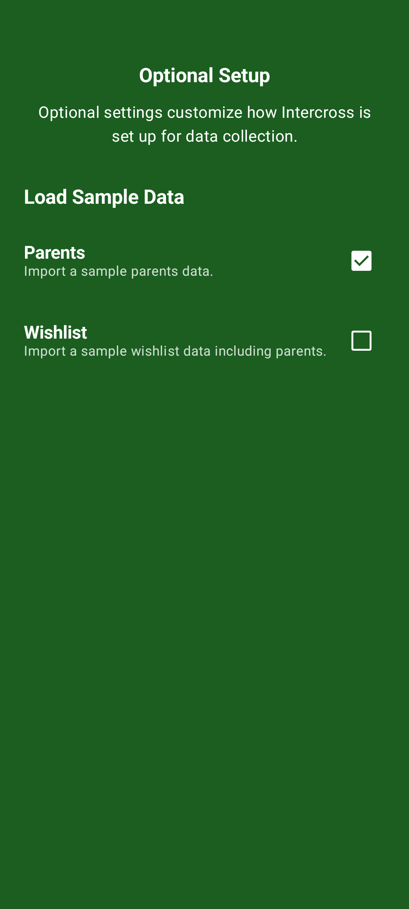

<link rel="stylesheet" type="text/css" href="_styles/styles.css">

# App Intro & Initial Setup

## Overview

When you first launch Intercross, you are guided through a series of setup screens to ensure the app is correctly configured for data collection. This includes granting necessary permissions, defining a storage location, and optionally loading sample data.

## Welcome Slide

The first slide introduces Intercross and its primary purpose: tracking plant breeding crosses and genetics research.

<figure class="image">
    

        
    

    <figcaption class="screenshot-caption"><i>Welcome slide introducing Intercross</i></figcaption>
</figure>

## Required Setup

To function correctly, Intercross requires two primary setup steps:

1. **Permissions** — Grant access to the camera (for barcode scanning) and storage (for data persistence).
2. **Define Storage** — Select a folder on your device where Intercross will store its database, exported files, and templates.

<figure class="image">
    

        
    

    <figcaption class="screenshot-caption"><i>Required setup: Permissions and Storage configuration</i></figcaption>
</figure>

## Optional Setup

The final setup slide allows you to prepopulate Intercross with sample data. This is recommended for first-time users to explore features like the **Cross Tracker** and **Cross Block** matrix immediately.

- **Sample Parents** — Imports a list of common apple varieties as germplasm.
- **Sample Wishlist** — Imports crossing targets for the sample parents.

<figure class="image">
    

        
    

    <figcaption class="screenshot-caption"><i>Optional setup: Toggle loading of sample data</i></figcaption>
</figure>

Once these steps are complete, tap the checkmark to enter the main app.
