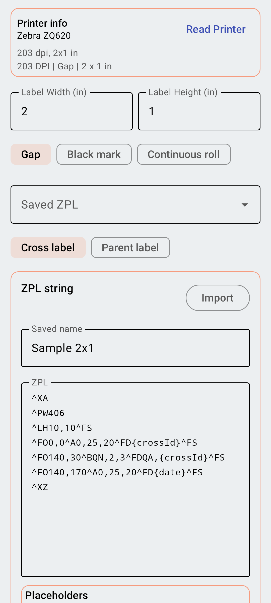
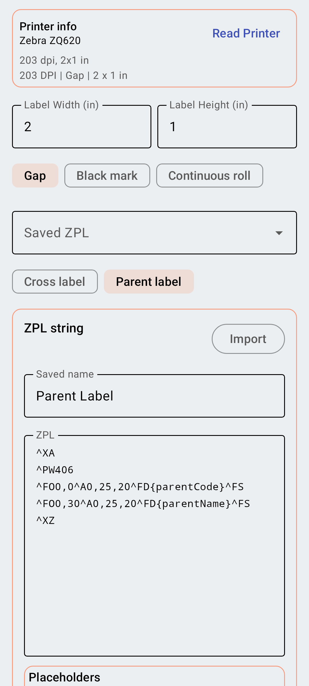

<link rel="stylesheet" type="text/css" href="_styles/styles.css">

# Label Template Editor

Intercross includes a powerful ZPL Label Designer that allows you to create, edit, and preview custom label templates for your crosses and parents.

<figure class="image">
    

        
    

    <figcaption class="screenshot-caption"><i>Label Template Editor</i></figcaption>
</figure>

## Key Features

The Label Template Editor provides several tools to help you design the perfect label:

### Label Dimensions
Set the physical width and height of your labels in inches. The designer automatically calculates the corresponding dimensions in dots based on your printer's DPI (e.g., 203 DPI or 300 DPI).

### Media Type
Select between **Continuous** (no gaps) or **Non-Continuous** (with gaps/notches) media. This setting ensures the ZPL code correctly instructs the printer on how to advance the media.

Manually setting label dimensions and media type replaces the need to use the Zebra Connect app.

### ZPL Editor & Placeholders
The ZPL editor gives you direct control over the label's code. You can use dynamic placeholders that will be replaced with real data at print time.

#### Available Placeholders (Cross Labels)
- `{crossId}`: The unique identifier for the cross.
- `{femaleId}` / `{maleId}`: Database IDs for the parents.
- `{femaleName}` / `{maleName}`: Readable codes for the parents.
- `{date}`: The date the cross was made.
- `{timestamp}`: The date with exact time.
- `{person}`: The name of the person who recorded the cross.
- `{experiment}`: The experiment name.
- `{type}`: The cross type.
- `{qrCrossId}`: Raw QR ZPL data

#### Available Placeholders (Parent Labels)
- `{parentId}`: The parent's unique identifier.
- `{parentName}`: The readable name of the parent.
- `{parentType}`: Male or Female.

<figure class="image">
    

        
    

    <figcaption class="screenshot-caption"><i>Parent label template with dynamic placeholders</i></figcaption>
</figure>

### Live Preview
Tap the **Render Preview** button to see a visual representation of your label. This helps verify that text, barcodes, and other elements are correctly positioned.

## Managing Templates

- **Save**: Save your current template to the app for quick access later.
- **Export**: Export your ZPL template as a file to share with other devices or breeders.
