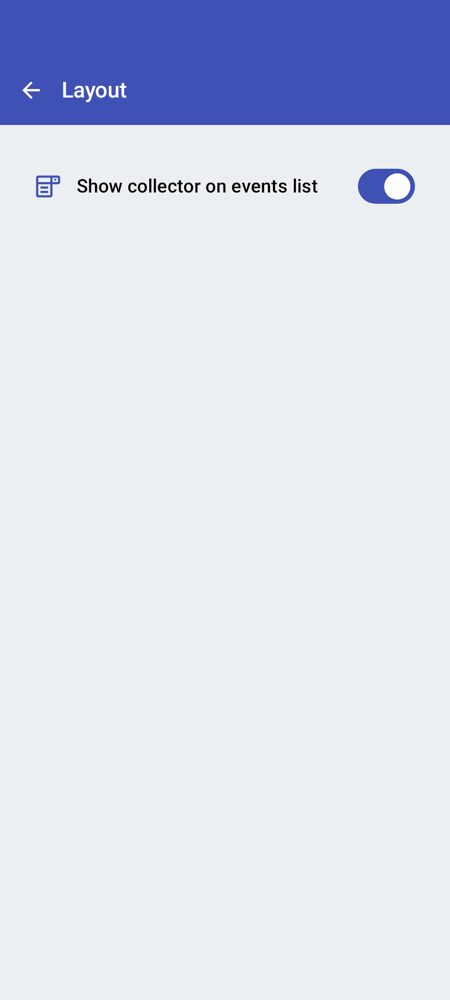

<link rel="stylesheet" type="text/css" href="_styles/styles.css">

# Layout Settings

<figure class="image">
    

        
    

    <figcaption class="screenshot-caption"><i>Layout settings screen</i></figcaption>
</figure>

Show collector on events list adds another form option on the main screen to choose which collector is crossing.