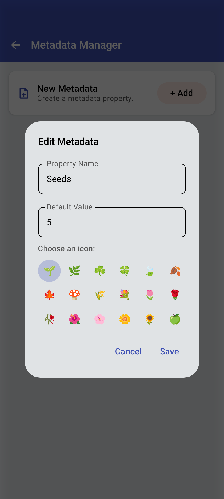

<link rel="stylesheet" type="text/css" href="_styles/styles.css">

# Metadata Settings

Metadata settings allow you to define and manage custom fields for collecting additional information about crosses.

## Managing Metadata

<figure class="image">
    

        
    

    <figcaption class="screenshot-caption"><i>Metadata settings with custom properties</i></figcaption>
</figure>

### Default Metadata Properties

Intercross includes three default metadata properties:
- **fruits** - Number of fruits
- **flowers** - Number of flowers
- **seeds** - Number of seeds

### Creating Custom Metadata

<figure class="image">
    

        
    

    <figcaption class="screenshot-caption"><i>Metadata editor dialog for custom properties</i></figcaption>
</figure>

1. Enter a name for the metadata property
2. Optionally set a default value
3. Choose an optional icon for better visualization
4. Save the property

