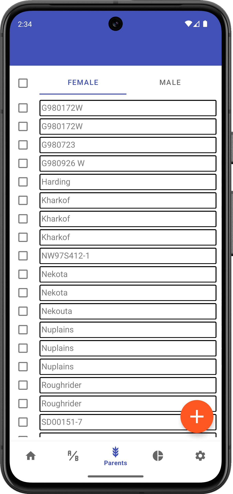

<link rel="stylesheet" type="text/css" href="_styles/styles.css">

# Parents

## Overview

The Parents section allows you to manage all parent plants used in your crossing program.

<figure class="image">
    
    <figcaption class="screenshot-caption"><i>Parents list view</i></figcaption>
</figure>

## Managing Parents

Parents are added automatically when recording crosses and can also be created manually or imported from a CSV file by pressing the  icon in the lower right.

## Parent Information

Each parent has:
- A unique barcode ID
- A human-readable name (optional)
- Sex information (used for crossing)

## Label Printing

You can print parent labels directly from Intercross:
1. Select a parent from the list
2. Press the  icon
3. Connect to a Zebra printer
4. Print the label

## Name Replacement

When parent names are available, they can replace barcodes in the interface for easier identification.
For example, in the sample files, `15RPN00001` will display as `Kharkof` throughout the app.

## Importing Parents

<figure class="image">
    
    <figcaption class="screenshot-caption"><i>File import screen</i></figcaption>
</figure>

The Parents import file format is a CSV containing a list of parents, with columns corresponding to:
- Unique ID
- Name
- Sex (coded as `0 = female`, `1 = male`)

Example:
```
id,name,sex
15RPN00001,Kharkof,0
15RPN00002,Blueboy,1
```