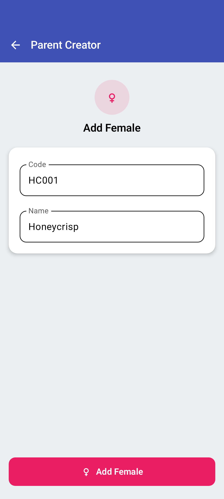
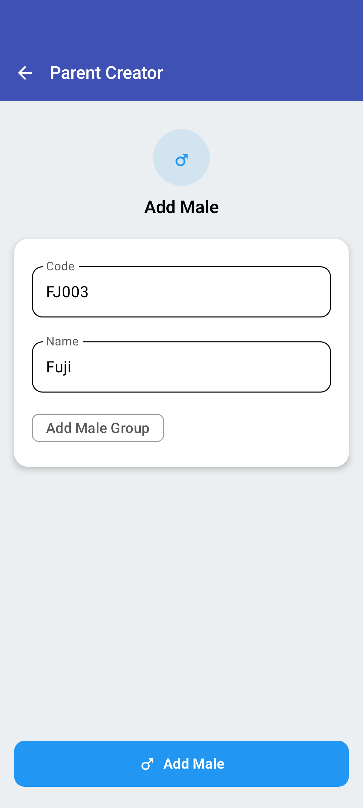
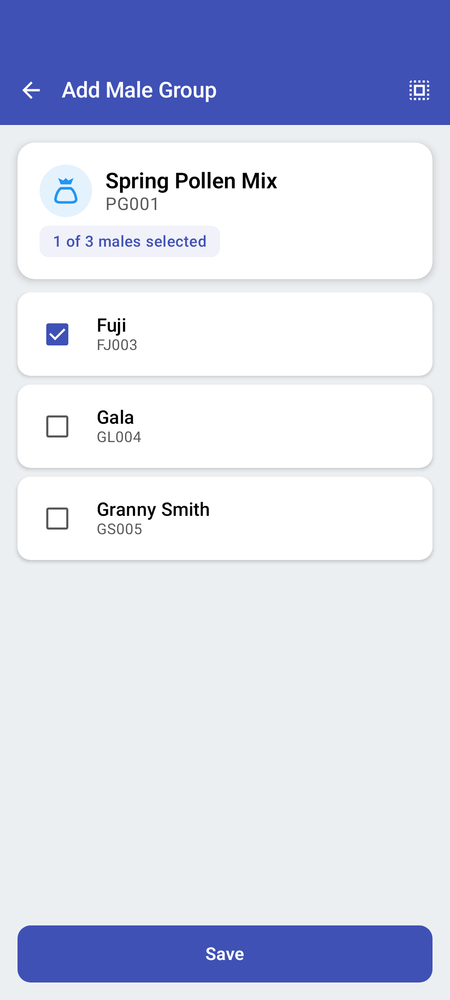

<link rel="stylesheet" type="text/css" href="_styles/styles.css">

# Parents

## Overview

The Parents section is where you manage all parent plants used in your breeding program. You can view parents by type (female/male), create new parents, configure pollen groups, and print parent labels.

<figure class="image">
    <div class="screenshot-frame">
        
    </div>
    <figcaption class="screenshot-caption"><i>Parents list with All Parents, Female, and Male tabs</i></figcaption>
</figure>

## Parent List

The parent list displays all registered parents with:
- **Selection checkbox** — Select multiple parents for batch operations
- **Parent name** — Human-readable name (e.g., "Honeycrisp")
- **Parent code** — Unique barcode ID (e.g., "HC001")
- **Type indicator** — Pink circle with ♀ for female, blue circle with ♂ for male
- **Cross count** — Number of crosses this parent has been involved in

### Tabs

Navigate between parent types:
- **All Parents** — Shows both male and female parents
- **Female** — Shows only female parents
- **Male** — Shows only male parents

## Creating a Parent

Tap the **+** button in the bottom right to create a new parent.

### Female Parent

<figure class="image">
    <div class="screenshot-frame">
        
    </div>
    <figcaption class="screenshot-caption"><i>Create Female Parent form</i></figcaption>
</figure>

Fill in:
- **Code** — Unique barcode ID for the parent
- **Name** — Human-readable name

### Male Parent

<figure class="image">
    <div class="screenshot-frame">
        
    </div>
    <figcaption class="screenshot-caption"><i>Create Male Parent form with pollen group option</i></figcaption>
</figure>

For male parents, you can also:
- **Add Male Group** — Configure a pollen group containing multiple male parents for bulk pollination

## Pollen Groups

Pollen groups allow you to define a pool of male parents for open pollination crosses.

<figure class="image">
    <div class="screenshot-frame">
        
    </div>
    <figcaption class="screenshot-caption"><i>Pollen Manager showing selected males in a pollen group</i></figcaption>
</figure>

### Managing Pollen Groups

1. Create a new pollen group with a unique code (e.g., "PG001")
2. Select which male parents belong to the group
3. Save the group configuration

When making crosses, you can reference the pollen group code instead of individual male parent IDs.

## Importing Parents

Parents can be imported from CSV files saved in the `parents_import` folder.

The import format should include:
- **Unique ID** — Barcode identifier
- **Name** — Human-readable name
- **Sex** — `0` for female, `1` for male

Example:
```csv
id,name,sex
HC001,Honeycrisp,0
FJ003,Fuji,1
```

## Label Printing

Select parents from the list and tap the **printer icon** to print parent labels directly to a connected Zebra printer.
