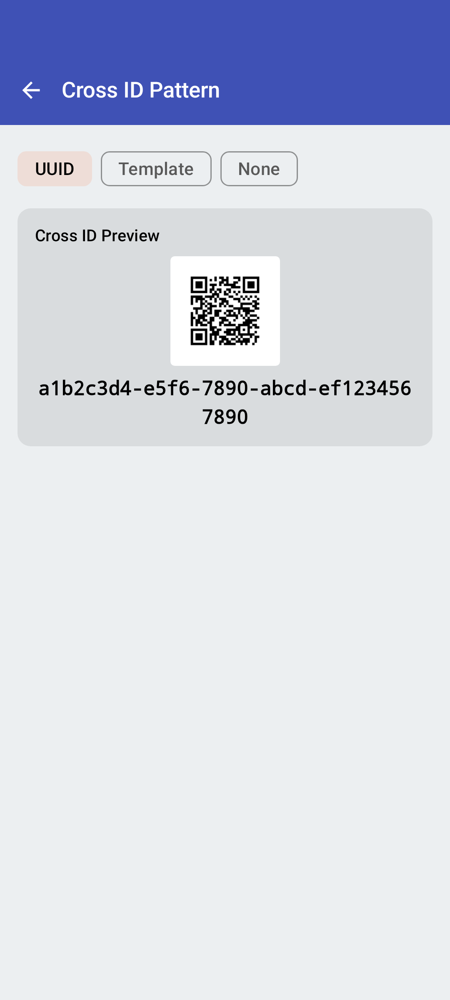
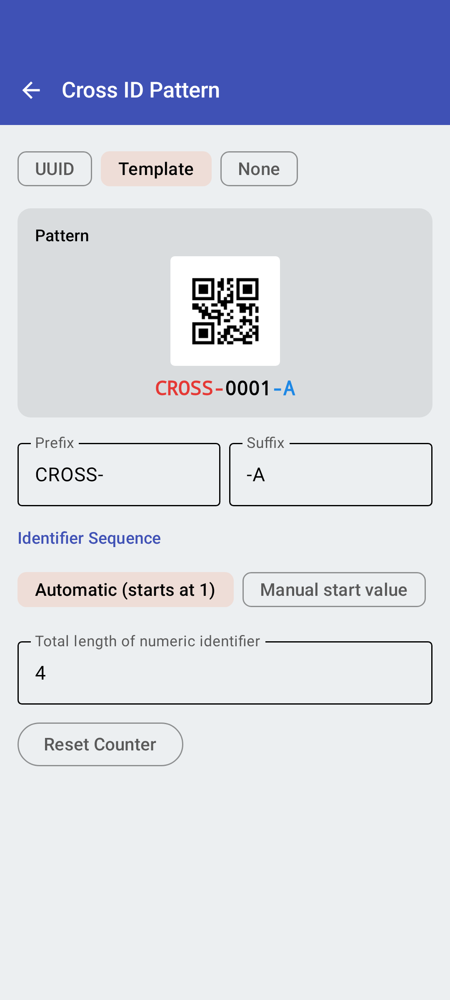

<link rel="stylesheet" type="text/css" href="_styles/styles.css">

# Pattern Settings

Pattern settings allow you to customize how cross IDs are generated in Intercross.

## UUID Mode

<figure class="image">
    

        
    

    <figcaption class="screenshot-caption"><i>UUID pattern settings</i></figcaption>
</figure>

By default, Intercross generates UUIDs (Universally Unique Identifiers) for each cross. This ensures globally unique cross IDs without any configuration.

## Custom Pattern Mode

<figure class="image">
    

        
    

    <figcaption class="screenshot-caption"><i>Custom pattern settings with live preview</i></figcaption>
</figure>

Custom patterns allow you to create more human-readable cross IDs.

### Live Preview

The pattern settings screen shows a live preview of what your cross ID will look like based on the current pattern configuration.

## No Pattern Mode

When no pattern is selected, you can manually enter cross IDs. This is useful when you have pre-printed labels or need to match external naming conventions.
