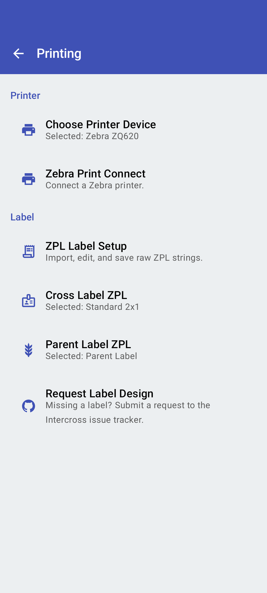
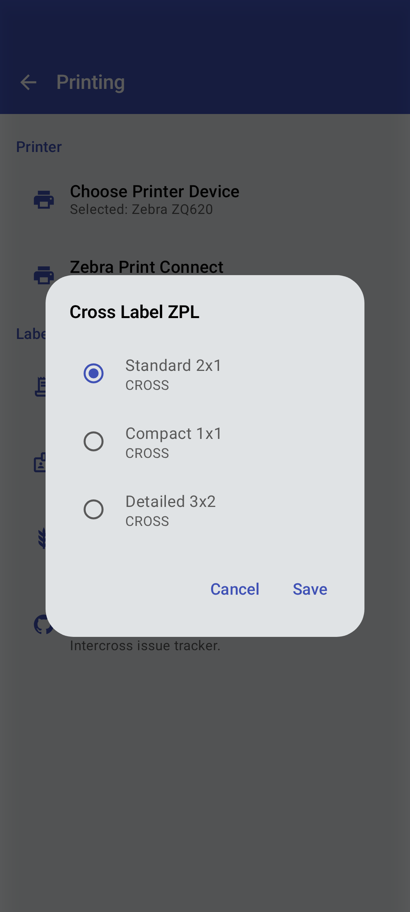

<link rel="stylesheet" type="text/css" href="_styles/styles.css">

# Printing Settings

Intercross supports printing cross labels directly to Zebra mobile printers, allowing you to immediately label your crosses as they are created.

    <figure class="image">
        

            
        

        <figcaption class="screenshot-caption"><i>Printing settings screen</i></figcaption>
    </figure>
    <figure class="image">
        

            
        

        <figcaption class="screenshot-caption"><i>Template selection dialog</i></figcaption>
    </figure>

##  Zebra Print Connect

Intercross integrates with the Zebra Print Connect app for printer communication which allows printing to any supported Zebra printer over Bluetooth.

## Label Designer

For information on how to design and customize your label templates, see the [Label Template Editor](settings/labels.md) documentation.

## Printing a Label

Labels can be printed from the Cross Details screen by tapping the print icon or in the parents page by selecting the parents that you wish to print labels for.

## Troubleshooting

If you encounter printing problems:
- Ensure your printer is charged and turned on
- Verify Bluetooth is enabled on your device
- Check that your printer is paired with your device
- Confirm Zebra Print Connect is properly configured
- Try restarting both your printer and device