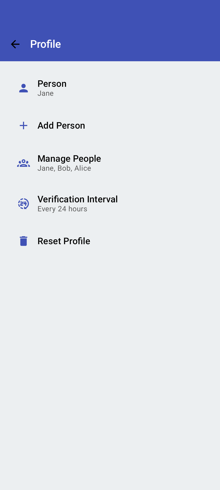
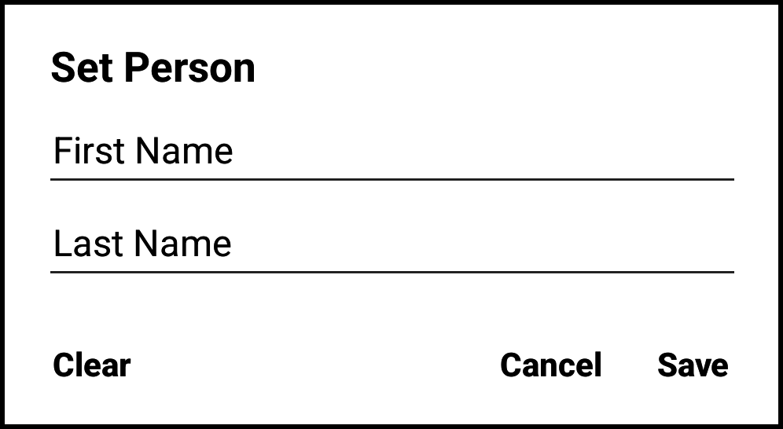
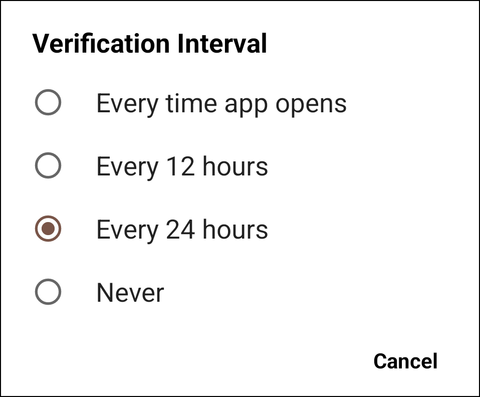

<link rel="stylesheet" type="text/css" href="_styles/styles.css">

# Profile Settings

<figure class="image">
    

        
    

    <figcaption class="screenshot-caption"><i>Profile settings screen</i></figcaption>
</figure>

####  Person

Sets the first and last name of the person operating Intercross.
This information is stored as metadata for each crossing event and is included in  [Export](export.md#export-format) files.

<figure class="image">
    

        
    

    <figcaption class="screenshot-caption"><i>Set Person dialog</i></figcaption>
</figure>

####  Reset Profile

Clears existing profile settings.

####  Verification Interval

Determines how frequently Intercross will ask for confirmation that the name matches the person operating the app.

<figure class="image">
    

        
    

    <figcaption class="screenshot-caption"><i>Choice of profile verification intervals</i></figcaption>
</figure>