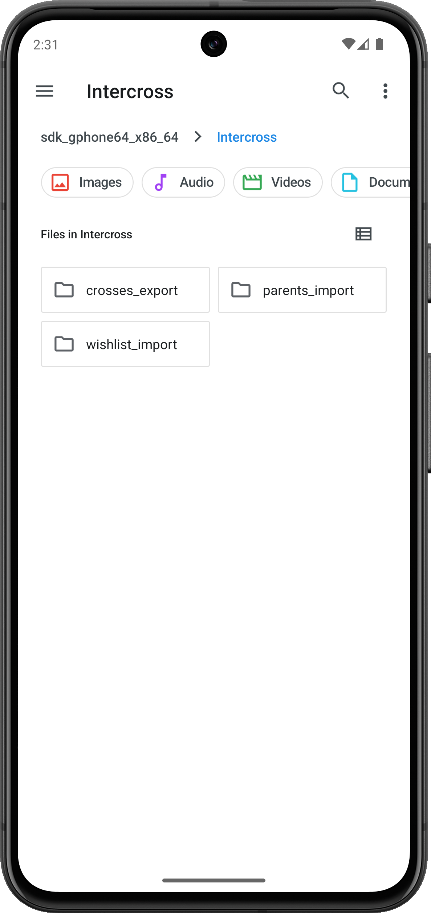

<link rel="stylesheet" type="text/css" href="_styles/styles.css">

# Storage

## Overview

Intercross requires proper storage permissions to save and manage your crossing data, import files, and export results.

<figure align="center" class="image">

<figcaption><i>Storage folder structure</i></figcaption>
</figure>

## Initial Setup

When you first launch Intercross, you'll be guided through a setup process that includes:

1. Requesting necessary storage permissions
2. Selecting a default storage location
3. Creating required folders for app data

If you deny storage permissions, the app will be unable to function properly and will prompt you to grant permissions on subsequent launches.

## Directory Structure

Intercross creates several folders in your selected storage location:

```
/Intercross/
  ├── parents_import        # Parent import files
  ├── crosses_export        # Cross data exports
  ├── wishlist_import       # Wishlist import files
```

## Template Files

Upon installation, Intercross creates template files in:
```
/android/data/org.phenoapps.intercross/cache
```

These templates provide the correct format for parent and wishlist imports.

## Changing Storage Location

To change your storage location after initial setup:

1. Go to Settings
2. Select Storage Settings
3. Choose "Change Storage Location"
4. Select a new location from your device

## Troubleshooting

If you encounter storage issues:

1. Ensure Intercross has storage permissions in your device settings
2. Check that your storage location has sufficient space
3. Verify that the selected storage location is accessible
4. If using an SD card, ensure it's properly mounted

On Android 10+ devices, be aware that apps have limited access to external storage. If you need to access Intercross files with other apps, consider setting your storage location to a shared folder.