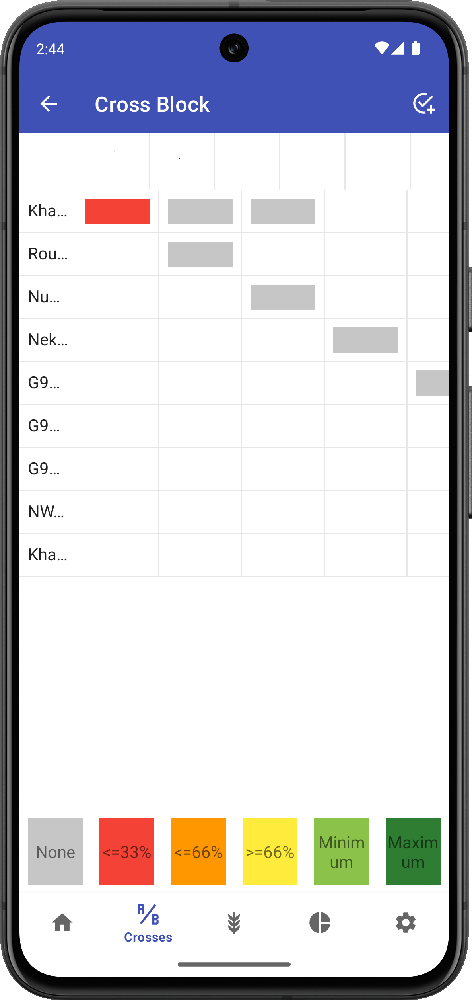

# Wishgrid

## Overview

The Wishgrid provides a visual matrix representation of your wishlist, making it easier to see crossing progress and opportunities.

<figure align="center" class="image">

<figcaption><i>Wishgrid visualization</i></figcaption>
</figure>

## Understanding the Grid

The Wishgrid displays:
- Female parents along one axis
- Male parents along the other axis
- Color-coded cells indicating crossing status

Cell shading indicates:
- White: No crossing planned
- Light shade: Planned but incomplete
- Dark shade: Completed (minimum requirement met)
- Check mark: Fully completed

## Navigating the Grid

Tap on any cell to see details about that specific cross combination or to record a new cross for that pair.

## Filtering and Sorting

Use the controls at the top of the screen to:
- Filter by parent ID or name
- Sort parents in a specific order
- Show only incomplete crosses